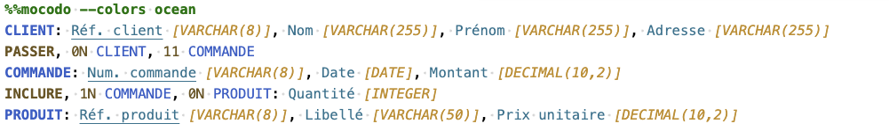
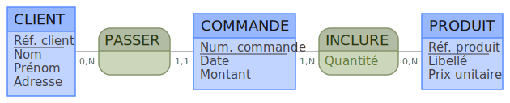
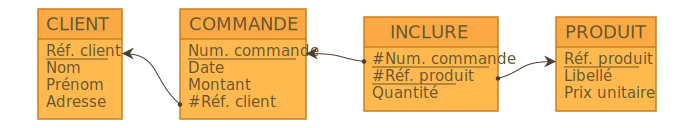
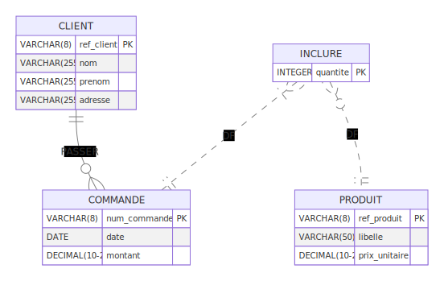
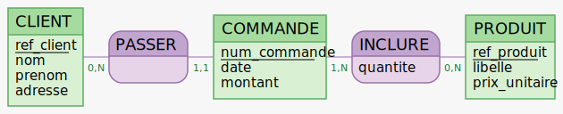
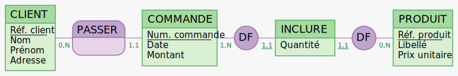

**Janvier 2024.** Mocodo [4.2](https://github.com/laowantong/mocodo/releases/tag/4.2.0) est maintenant disponible sous [Basthon](https://basthon.fr). Après [Mocodo _online_](https://www.mocodo.net), Basthon constitue donc une deuxième manière d'utiliser Mocodo sans rien installer. Elle a l'avantage de donner accès à l'intégralité des fonctionnalités du logiciel. Merci à son auteur, Romain Casati !

**Novembre 2023.** Mocodo [4.1](https://github.com/laowantong/mocodo/releases/tag/4.1.0) gère les bibliothèques de MCD. Un enseignant peut par exemple placer sur son propre serveur la correction d'un MCD sous un nom « secret », que le moment venu il communiquera oralement à ses étudiants pour leur permettre de le récupérer (soit sous Mocodo online, soit en ligne de commande).

**Octobre 2023.** Mocodo [4](https://github.com/laowantong/mocodo/releases/tag/4.0.4) introduit la gestion manuelle et automatique des contraintes d'optionalité et d'unicité, améliore les interfaces graphique et en ligne de commande, et ajoute un grand nombre de fonctionnalités : coloration syntaxique, liens de partage, exportation en UML, en notation de Chen et _crow's foot_, génération de MCD aléatoires, décomposition des associations et autres opérations de réécriture.

**Septembre 2022.** Mocodo 3 introduit l'[héritage](https://rawgit.com/laowantong/mocodo/master/doc/fr_refman.html#Héritage-(ou-spécialisation)), l'[agrégation](https://rawgit.com/laowantong/mocodo/master/doc/fr_refman.html#Agrégation-(ou-pseudo-entité)), les [calques](https://rawgit.com/laowantong/mocodo/master/doc/fr_refman.html#Héritage-(ou-spécialisation)), les [sorties PDF et PNG](https://rawgit.com/laowantong/mocodo/master/doc/fr_refman.html#Héritage-(ou-spécialisation)), etc. : [3.0](https://github.com/laowantong/mocodo/releases/tag/3.0), [3.1](https://github.com/laowantong/mocodo/releases/tag/3.1.0), [3.2](https://github.com/laowantong/mocodo/releases/tag/3.2.0).

------

[Documentation](https://rawgit.com/laowantong/mocodo/master/doc/fr_refman.html) sur une seule page, incluant la sortie de [`mocodo --help`](https://rawgit.com/laowantong/mocodo/master/doc/fr_refman.html#mocodo---help) et l'[aide-mémoire des transformations](https://rawgit.com/laowantong/mocodo/master/doc/fr_refman.html#Aide-mémoire-des-arguments-de---transform).

----


Mocodo est un logiciel d'aide à l'enseignement et à l'apprentissage des [bases de données relationnelles](https://fr.wikipedia.org/wiki/Base_de_données_relationnelle).

- En entrée, il prend un [MCD](https://fr.wikipedia.org/wiki/Modèle_entité-association) (modèle conceptuel de données) décrit dans un langage dédié minimaliste.
- En sortie, il produit un diagramme entité-association et, à la demande, un [MLD](https://fr.wikipedia.org/wiki/Merise_(informatique)#MLD_:_modèle_logique_des_données) (schéma relationnel, sous forme graphique ou textuelle), un [DDL](https://fr.wikipedia.org/wiki/Langage_de_définition_de_données) (script SQL de création de la base), un [diagramme de classes UML](https://fr.wikipedia.org/wiki/Diagramme_de_classes), etc.
- En bonus, il est capable de réarranger automatiquement votre MCD de façon esthétique, et de lui appliquer des opérations de réécriture qui vont du mondain (typographie) à l'académique (décomposition d'associations), en passant par le merveilleux (inférence de types, génération d'exercices et d'exemples).

Vous pouvez utiliser Mocodo :

- sur son site web [Mocodo _online_](https://www.mocodo.net) ;
- dans un document [Jupyter Notebook](https://jupyter.org), avec ou [sans](https://basthon.fr) installation ;
- en ligne de commande ;
- comme une bibliothèque Python.

## Tracé du modèle conceptuel

Ci-dessous, un exemple d'utilisation sous Jupyter Notebook. L'appel du programme est en première ligne ; le texte-source proprement dit, lignes suivantes. En sortie, le diagramme conceptuel, égayé au passage par l'option `--colors` :





## Opérations de conversion

On peut récupérer ce texte-source avec `--input` pour lui appliquer diverses opérations. Ainsi, l'appel suivant génère et affiche son MLD, son diagramme relationnel et son DDL :

```
%mocodo --input ccp --transform mld diagram ddl --colors desert
```

---

- **CLIENT** (<ins>Réf. client</ins>, Nom, Prénom, Adresse)
- **COMMANDE** (<ins>Num. commande</ins>, Date, Montant, _#Réf. client_)
- **INCLURE** (<ins>_#Num. commande_</ins>, <ins>_#Réf. produit_</ins>, Quantité)
- **PRODUIT** (<ins>Réf. produit</ins>, Libellé, Prix unitaire)

---



---

```sql
CREATE TABLE CLIENT (
  PRIMARY KEY (ref_client),
  ref_client VARCHAR(8) NOT NULL,
  nom VARCHAR(255),
  prenom VARCHAR(255),
  adresse VARCHAR(255)
);

CREATE TABLE COMMANDE (
  PRIMARY KEY (num_commande),
  num_commande VARCHAR(8) NOT NULL,
  date DATE,
  montant DECIMAL(10,2),
  ref_client VARCHAR(8) NOT NULL
);

CREATE TABLE INCLURE (
  PRIMARY KEY (num_commande, ref_produit),
  num_commande VARCHAR(8) NOT NULL,
  ref_produit VARCHAR(8) NOT NULL,
  quantite INTEGER
);

CREATE TABLE PRODUIT (
  PRIMARY KEY (ref_produit),
  ref_produit VARCHAR(8) NOT NULL,
  libelle VARCHAR(50),
  prix_unitaire DECIMAL(10,2)
);

ALTER TABLE COMMANDE ADD FOREIGN KEY (ref_client) REFERENCES CLIENT (ref_client);

ALTER TABLE INCLURE ADD FOREIGN KEY (ref_produit) REFERENCES PRODUIT (ref_produit);
ALTER TABLE INCLURE ADD FOREIGN KEY (num_commande) REFERENCES COMMANDE (num_commande);
```

Dans la suite, pour épargner la frappe, les options `--input` et `--transform` seront respectivement abrégées en `-i` et `-t`.

Les opérations de conversion ne se limitent pas forcément au schéma relationnel. En voici une qui extrait un dictionnaire des données, par défaut sous la forme d'un tableau Markdown à trois colonnes :

```
%mocodo -i ccp -t data_dict
```

---

| Entité ou association | Libellé de l'attribut | Type          |
|:----------------------|:----------------------|:--------------|
| CLIENT                | Adresse               | VARCHAR(255)  |
| "                     | Nom                   | VARCHAR(255)  |
| "                     | Prénom                | VARCHAR(255)  |
| "                     | Réf. client           | VARCHAR(8)    |
| COMMANDE              | Date                  | DATE          |
| "                     | Montant               | DECIMAL(10,2) |
| "                     | Num. commande         | VARCHAR(8)    |
| INCLURE               | Quantité              | INTEGER       |
| PRODUIT               | Libellé               | VARCHAR(50)   |
| "                     | Prix unitaire         | DECIMAL(10,2) |
| "                     | Réf. produit          | VARCHAR(8)    |

Une autre qui transcrit le MCD dans la notation _crow's foot_ (`crow`) pour [Mermaid](http://mermaid.js.org) (`mmd`) :

```
%mocodo -i ccp -t crow:mmd
```

---

```mmd
erDiagram
  CLIENT {
    VARCHAR(8) ref_client PK
    VARCHAR(255) nom
    VARCHAR(255) prenom
    VARCHAR(255) adresse
  }
  COMMANDE {
    VARCHAR(8) num_commande PK
    DATE date
    DECIMAL(10-2) montant
  }
  INCLURE {
    INTEGER quantite PK
  }
  PRODUIT {
    VARCHAR(8) ref_produit PK
    VARCHAR(50) libelle
    DECIMAL(10-2) prix_unitaire
  }
  CLIENT ||--o{ COMMANDE: PASSER
  INCLURE }|..|| COMMANDE: DF
  INCLURE }o..|| PRODUIT: DF

```

Le rendu des diagrammes décrits dans des langages-tiers (comme Mermaid) n'est pas directement pris en charge, mais peut être délégué (`--defer`) de façon transparente au service web approprié. Dans ce cas, c'est la sortie graphique qui est affichée :

```
%mocodo -i ccp -t crow:mmd --defer
```

---



## Opérations de réécriture

Une **réécriture** transforme un MCD Mocodo en un autre MCD Mocodo (au contraire d'une **conversion**, qui produit un animal d'une espèce différente).

Heureusement, l'utilisateur n'a pas à réfléchir si la transformation qu'il souhaite appliquer est une réécriture ou une conversion : dans les deux cas, il invoque `-t` (c'est-à-dire `--transform`), et Mocodo se débrouille.

En guise de premier exemple de réécriture, mettons les noms des entités et associations (`boxes`) en majuscules, et les libellés (`labels`) en ASCII et _snake case_ :

```
%mocodo -i ccp -t upper:boxes ascii:labels snake:labels --colors brewer+3
```



---

    %%mocodo --colors brewer+3
    CLIENT: ref_client [VARCHAR(8)], nom [VARCHAR(255)], prenom [VARCHAR(255)], adresse [VARCHAR(255)]
    PASSER, 0N CLIENT, 11 COMMANDE
    COMMANDE: num_commande [VARCHAR(8)], date [DATE], montant [DECIMAL(10,2)]
    INCLURE, 1N COMMANDE, 0N PRODUIT: quantite [INTEGER]
    PRODUIT: ref_produit [VARCHAR(8)], libelle [VARCHAR(50)], prix_unitaire [DECIMAL(10,2)]

Remarquez que l'exécution d'une réécriture affiche, au-dessous du diagramme, le code-source résultant. Celui-ci est précédé de la commande magique originale, _privée de l'option `-i` et de toute opération de réécriture_. Ces dispositions permettent de continuer à travailler directement dessus si on le copie-colle dans une autre cellule.

Plusieurs opérations de réécriture de nature sémantique sont également offertes. Par exemple, on peut décomposer un MCD quelconque en un MCD équivalent, mais n'employant que des dépendances fonctionnelles et des entités faibles :

```
%mocodo -i ccp --select mcd -t explode:weak,arity=2 arrange:wide --seed=3 --colors brewer+3
```



Notez la sous-option `arrange:wide`. Elle a procédé à une réorganisation aléatoire des boîtes, ce que l'insertion de deux nouvelles associations de dépendance fonctionnelles avait rendu nécessaire. Quant à l'option `--seed=3`, elle garantit que le résultat sera le même à chaque exécution.

Pour vous familiariser avec Mocodo, le plus simple est d'utiliser [sa version en ligne](https://www.mocodo.net). Vous pourrez ensuite vous plonger dans la [documentation](https://rawgit.com/laowantong/mocodo/master/doc/fr_refman.html).
