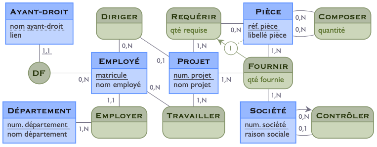
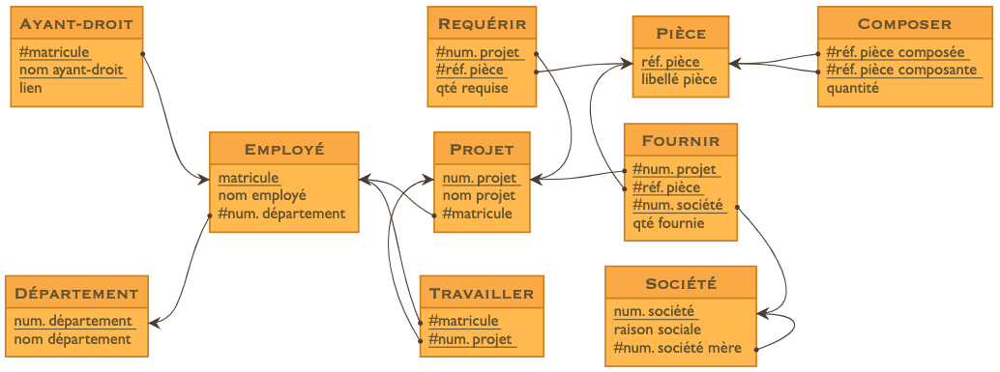

Mocodo est un logiciel d'aide à l'enseignement et à la conception des [bases de données relationnelles](https://fr.wikipedia.org/wiki/Base_de_données_relationnelle).

- En entrée, il prend une description textuelle des entités et associations du modèle conceptuel de données ([MCD](https://fr.wikipedia.org/wiki/Modèle_entité-association)).
- En sortie, il produit son diagramme entité-association en [SVG](https://fr.wikipedia.org/wiki/Scalable_Vector_Graphics) et son schéma relationnel ([MLD](https://fr.wikipedia.org/wiki/Merise_&amp;# 40;informatique&amp;# 41;#Le_MLD_mod.C3.A8le_logique_des_donn.C3.A9es)) en [SQL](https://fr.wikipedia.org/wiki/Structured_Query_Language), [LaTeX](https://fr.wikipedia.org/wiki/LaTeX), [Markdown](https://fr.wikipedia.org/wiki/Markdown), etc.

Ci-dessous, un exemple sous Jupyter / IPython Notebook. L'appel du programme se fait en première ligne, sur un texte d'entrée donné lignes suivantes.

    %%mocodo --mld --colors ocean --shapes copperplate --relations diagram markdown_data_dict
    DF, 11 Élève, 1N Classe
    Classe: Num. classe, Num. salle
    Faire Cours, 1N Classe, 1N Prof: Vol. horaire
    Catégorie: Code catégorie, Nom catégorie
    
    Élève: Num. élève, Nom élève
    Noter, 1N Élève, 0N Prof, 0N Matière, 1N Date: Note
    Prof: Num. prof, Nom prof
    Relever, 0N Catégorie, 11 Prof
    
    Date: Date
    Matière: Libellé matière
    Enseigner, 11 Prof, 1N Matière

En sortie, le MCD (diagramme conceptuel) et le MLD (schéma relationnel) correspondants:

L'appel ci-dessus a également construit le dictionnaire des données:

- Num. classe
- Num. salle
- Vol. horaire
- Code catégorie
- Nom catégorie
- Num. élève
- Nom élève
- Note
- Num. prof
- Nom prof
- Date
- Libellé matière

Ainsi que le diagramme relationnel, qui peut être visualisé par un nouvel appel:

    %mocodo --input mocodo_notebook/sandbox.mld --colors desert

La devise de Mocodo, « nickel, ni souris », en synthétise les points forts:

- description textuelle des données. L'utilisateur n'a pas à renseigner, placer et déplacer des éléments comme avec une lessive ordinaire. Il ne fournit rien de plus que les informations définissant son MCD. L'outil s'occupe tout seul du plongement;
- propreté du rendu. La sortie se fait en vectoriel, prête à être affichée, imprimée, agrandie, exportée dans une multitude de formats sans perte de qualité;
- rapidité des retouches. L'utilisateur rectifie les alignements en insérant des éléments invisibles, en dupliquant des coordonnées ou en ajustant des facteurs mutiplicatifs: là encore, il travaille sur une description textuelle, et non directement sur le dessin.

Mocodo est libre, gratuit et multiplateforme. Si vous l'aimez, répandez la bonne nouvelle en incluant l'un de ses logos dans votre support: cela multipliera ses chances d'attirer des contributeurs qui le feront évoluer.

Pour vous familiariser avec Mocodo, le mieux est d'utiliser [sa version en ligne](http://mocodo.wingi.net).

Pour en savoir plus, lisez la documentation [au format HTML](https://rawgit.com/laowantong/mocodo/master/doc/fr_refman.html) ou téléchargez-la [au format Jupyter / IPython Notebook](doc/fr_refman.ipynb).