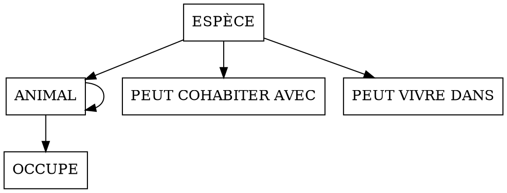

# Snapshots
## Source

```
%%mocodo --mld --relations mysql html_verbose latex text sqlite

:
    PEUT COHABITER AVEC, 0N ESPÈCE, 0N [commensale] ESPÈCE: nb. max. commensaux
:
:
:

PEUT VIVRE DANS, 1N ESPÈCE, 1N ENCLOS: nb. max. congénères
ESPÈCE: code espèce, 1_nom latin, nom vernaculaire
  DF, 0N ESPÈCE, _11 ANIMAL
:
  CARNIVORE: quantité viande

ENCLOS: num. enclos
      OCCUPE, 1N ANIMAL, /1N PÉRIODE, 1N ENCLOS
  ANIMAL: nom, sexe, _date naissance, date décès
  /\ ANIMAL <= CARNIVORE, HERBIVORE: type alimentation
:

:
      PÉRIODE: date début, _date fin
    A MÈRE, 01 ANIMAL, 0N> [mère] ANIMAL
:
  HERBIVORE: plante préférée

      (   ) [For testing purpose] --> ENCLOS, ..PÉRIODE, --OCCUPE: ENCLOS, PÉRIODE
```

## SVG output

### Static


### Dynamic


## Relational output

### `debug.json`

```markdown
| Relation | Attribute | `nature` | `adjacent_source` | `outer_source` |
|---|---|---|---|---|
| ANIMAL | code espèce | `primary_foreign_key` | ESPÈCE | ESPÈCE |
| ANIMAL | nom | `primary_key` | None | None |
| ANIMAL | date naissance | `primary_key` | None | None |
| ANIMAL | sexe | `normal_attribute` | None | None |
| ANIMAL | date décès | `normal_attribute` | None | None |
| ANIMAL | code espèce mère | `foreign_key` | ANIMAL | ANIMAL |
| ANIMAL | nom mère | `foreign_key` | ANIMAL | ANIMAL |
| ANIMAL | date naissance mère | `foreign_key` | ANIMAL | ANIMAL |
| ANIMAL | type alimentation | `deleted_child_discriminant_` | None | None |
| ANIMAL | CARNIVORE | `deleted_child_entity_name` | CARNIVORE | CARNIVORE |
| ANIMAL | quantité viande | `deleted_child_attribute` | CARNIVORE | None |
| ANIMAL | HERBIVORE | `deleted_child_entity_name` | HERBIVORE | HERBIVORE |
| ANIMAL | plante préférée | `deleted_child_attribute` | HERBIVORE | None |
| ESPÈCE | code espèce | `primary_key` | None | None |
| ESPÈCE | nom latin | `alt_normal_attribute` | None | None |
| ESPÈCE | nom vernaculaire | `normal_attribute` | None | None |
| OCCUPE | code espèce | `primary_foreign_key` | ANIMAL | ANIMAL |
| OCCUPE | nom | `primary_foreign_key` | ANIMAL | ANIMAL |
| OCCUPE | date naissance | `primary_foreign_key` | ANIMAL | ANIMAL |
| OCCUPE | num. enclos | `primary_key` | ENCLOS | ENCLOS |
| OCCUPE | date début | `normal_attribute` | PÉRIODE | PÉRIODE |
| OCCUPE | date fin | `normal_attribute` | PÉRIODE | PÉRIODE |
| PEUT COHABITER AVEC | code espèce | `primary_foreign_key` | ESPÈCE | ESPÈCE |
| PEUT COHABITER AVEC | code espèce commensale | `primary_foreign_key` | ESPÈCE | ESPÈCE |
| PEUT COHABITER AVEC | nb. max. commensaux | `association_attribute` | None | None |
| PEUT VIVRE DANS | code espèce | `primary_foreign_key` | ESPÈCE | ESPÈCE |
| PEUT VIVRE DANS | num. enclos | `primary_key` | ENCLOS | ENCLOS |
| PEUT VIVRE DANS | nb. max. congénères | `association_attribute` | None | None |
```

### `dependencies.json`



### `diagram.json`

```plain
%%mocodo
:::
PEUT COHABITER AVEC: #code espèce > ESPÈCE > code espèce, _#code espèce commensale > ESPÈCE > code espèce, nb. max. commensaux
:::


:
PEUT VIVRE DANS: #code espèce > ESPÈCE > code espèce, _num. enclos, nb. max. congénères
:
ESPÈCE: code espèce, nom latin, nom vernaculaire
:::


:::
OCCUPE: #code espèce > ANIMAL > code espèce, _#nom > ANIMAL > nom, _#date naissance > ANIMAL > date naissance, _num. enclos, date début, date fin
:
ANIMAL: #code espèce > ESPÈCE > code espèce, _nom, _date naissance, sexe, date décès, #code espèce mère > ANIMAL > code espèce, #nom mère > ANIMAL > nom, #date naissance mère > ANIMAL > date naissance, type alimentation, CARNIVORE, quantité viande, HERBIVORE, plante préférée
:
```

### `html.json`

```html
<html>
<head>
<meta charset='utf-8'>
<style>
  #mld .relation { font-variant: small-caps; font-weight: bold }
  #mld .primary { text-decoration: underline }
  #mld .foreign { font-style: oblique }
  #mld .normal { }
</style>
</head>
<body>
<div id='mld'>
<div>
  <span class='relation'>ANIMAL</span> (
    <span class='foreign primary'>#code espèce</span>,
    <span class='primary'>nom</span>,
    <span class='primary'>date naissance</span>,
    <span class='normal'>sexe</span>,
    <span class='normal'>date décès</span>,
    <span class='foreign'>#code espèce mère</span>,
    <span class='foreign'>#nom mère</span>,
    <span class='foreign'>#date naissance mère</span>,
    <span class='normal'>type alimentation</span>,
    <span class='normal'>CARNIVORE</span>,
    <span class='normal'>quantité viande</span>,
    <span class='normal'>HERBIVORE</span>,
    <span class='normal'>plante préférée</span>
  )
</div>
<div>
  <span class='relation'>ESPÈCE</span> (
    <span class='primary'>code espèce</span>,
    <span class='normal'>nom latin<sup>u1</sup></span>,
    <span class='normal'>nom vernaculaire</span>
  )
</div>
<div>
  <span class='relation'>OCCUPE</span> (
    <span class='foreign primary'>#code espèce</span>,
    <span class='foreign primary'>#nom</span>,
    <span class='foreign primary'>#date naissance</span>,
    <span class='primary'>num. enclos</span>,
    <span class='normal'>date début</span>,
    <span class='normal'>date fin</span>
  )
</div>
<div>
  <span class='relation'>PEUT COHABITER AVEC</span> (
    <span class='foreign primary'>#code espèce</span>,
    <span class='foreign primary'>#code espèce commensale</span>,
    <span class='normal'>nb. max. commensaux</span>
  )
</div>
<div>
  <span class='relation'>PEUT VIVRE DANS</span> (
    <span class='foreign primary'>#code espèce</span>,
    <span class='primary'>num. enclos</span>,
    <span class='normal'>nb. max. congénères</span>
  )
</div>
</div>
</body>
</html>
```

### `html_barebones.json`

```html
<div id='mld'>
<div>
  <span class='relation'>ANIMAL</span> (
    <span class='foreign primary'>#code espèce</span>,
    <span class='primary'>nom</span>,
    <span class='primary'>date naissance</span>,
    <span class='normal'>sexe</span>,
    <span class='normal'>date décès</span>,
    <span class='foreign'>#code espèce mère</span>,
    <span class='foreign'>#nom mère</span>,
    <span class='foreign'>#date naissance mère</span>,
    <span class='normal'>type alimentation</span>,
    <span class='normal'>CARNIVORE</span>,
    <span class='normal'>quantité viande</span>,
    <span class='normal'>HERBIVORE</span>,
    <span class='normal'>plante préférée</span>
  )
</div>
<div>
  <span class='relation'>ESPÈCE</span> (
    <span class='primary'>code espèce</span>,
    <span class='normal'>nom latin<sup>u1</sup></span>,
    <span class='normal'>nom vernaculaire</span>
  )
</div>
<div>
  <span class='relation'>OCCUPE</span> (
    <span class='foreign primary'>#code espèce</span>,
    <span class='foreign primary'>#nom</span>,
    <span class='foreign primary'>#date naissance</span>,
    <span class='primary'>num. enclos</span>,
    <span class='normal'>date début</span>,
    <span class='normal'>date fin</span>
  )
</div>
<div>
  <span class='relation'>PEUT COHABITER AVEC</span> (
    <span class='foreign primary'>#code espèce</span>,
    <span class='foreign primary'>#code espèce commensale</span>,
    <span class='normal'>nb. max. commensaux</span>
  )
</div>
<div>
  <span class='relation'>PEUT VIVRE DANS</span> (
    <span class='foreign primary'>#code espèce</span>,
    <span class='primary'>num. enclos</span>,
    <span class='normal'>nb. max. congénères</span>
  )
</div>
</div>
```

### `html_verbose.json`

```html
<html>
<head>
<meta charset='utf-8'>
<style>
  #mld .relation { font-variant: small-caps; font-weight: bold }
  #mld .primary { text-decoration: underline }
  #mld .foreign { font-style: oblique }
  #mld .normal { }
  #mld strong { font-weight: bold }
  #mld i { font-style: italic }
  #mld ul { list-style-type:square; margin: 0 0 1em 2em }
</style>
</head>
<body>
<div id='mld'>
<div>
  <details><summary><span class='relation'>ANIMAL</span> (
    <span title='primary_foreign_key (ESPÈCE)' class='foreign primary'>#code espèce</span>,
    <span title='primary_key (None)' class='primary'>nom</span>,
    <span title='primary_key (None)' class='primary'>date naissance</span>,
    <span title='normal_attribute (None)' class='normal'>sexe</span>,
    <span title='normal_attribute (None)' class='normal'>date décès</span>,
    <span title='foreign_key (ANIMAL)' class='foreign'>#code espèce mère</span>,
    <span title='foreign_key (ANIMAL)' class='foreign'>#nom mère</span>,
    <span title='foreign_key (ANIMAL)' class='foreign'>#date naissance mère</span>,
    <span title='deleted_child_discriminant_ (None)' class='normal'>type alimentation</span>,
    <span title='deleted_child_entity_name (CARNIVORE)' class='normal'>CARNIVORE</span>,
    <span title='deleted_child_attribute (None)' class='normal'>quantité viande</span>,
    <span title='deleted_child_entity_name (HERBIVORE)' class='normal'>HERBIVORE</span>,
    <span title='deleted_child_attribute (None)' class='normal'>plante préférée</span>
  )</summary>
  <ul>
    <li>Le champ <i>code espèce</i> fait partie de la clé primaire de la table. C'est une clé étrangère qui a migré directement à partir de l'entité <i>ESPÈCE</i>.</li>
    <li>Les champs <i>nom</i> et <i>date naissance</i> font partie de la clé primaire de la table. C'était déjà des identifiants de l'entité <i>ANIMAL</i>.</li>
    <li>Les champs <i>sexe</i> et <i>date décès</i> étaient déjà de simples attributs de l'entité <i>ANIMAL</i>.</li>
    <li>Le champ <i>code espèce mère</i> est une clé étrangère. Il a migré par l'association de dépendance fonctionnelle <i>A MÈRE</i> à partir de l'entité <i>ANIMAL</i> en perdant son caractère identifiant.</li>
    <li>Le champ <i>nom mère</i> est une clé étrangère. Il a migré par l'association de dépendance fonctionnelle <i>A MÈRE</i> à partir de l'entité <i>ANIMAL</i> en perdant son caractère identifiant.</li>
    <li>Le champ <i>date naissance mère</i> est une clé étrangère. Il a migré par l'association de dépendance fonctionnelle <i>A MÈRE</i> à partir de l'entité <i>ANIMAL</i> en perdant son caractère identifiant.</li>
    <li>Un champ entier <i>type alimentation</i> est ajouté pour indiquer la nature de la spécialisation. Il est interprété comme un code binaire : bit 1 pour la première entité-fille, bit 2 pour la deuxième, etc. Peut être vide, du fait de l'absence de contrainte de totalité.</li>
    <li>Un champ booléen <i>CARNIVORE</i> est ajouté pour indiquer si on a affaire ou pas à la spécialisation de même nom.</li>
    <li>Le champ <i>quantité viande</i> a migré à partir de l'entité-fille <i>CARNIVORE</i> (supprimée).</li>
    <li>Un champ booléen <i>HERBIVORE</i> est ajouté pour indiquer si on a affaire ou pas à la spécialisation de même nom.</li>
    <li>Le champ <i>plante préférée</i> a migré à partir de l'entité-fille <i>HERBIVORE</i> (supprimée).</li>
  </ul></details>
</div>

<div>
  <details><summary><span class='relation'>ESPÈCE</span> (
    <span title='primary_key (None)' class='primary'>code espèce</span>,
    <span title='alt_key (None)' class='normal'>nom latin<sup>u1</sup></span>,
    <span title='normal_attribute (None)' class='normal'>nom vernaculaire</span>
  )</summary>
  <ul>
    <li>Le champ <i>code espèce</i> constitue la clé primaire de la table. C'était déjà un identifiant de l'entité <i>ESPÈCE</i>.</li>
    <li>Le champ <i>nom latin</i> était déjà un simple attribut de l'entité <i>ESPÈCE</i>. Il fait partie du groupe 1 des clés candidates qui n'ont pas été retenues comme clé primaire.</li>
    <li>Le champ <i>nom vernaculaire</i> était déjà un simple attribut de l'entité <i>ESPÈCE</i>.</li>
  </ul></details>
</div>

<div>
  <details><summary><span class='relation'>OCCUPE</span> (
    <span title='primary_foreign_key (ANIMAL)' class='foreign primary'>#code espèce</span>,
    <span title='primary_foreign_key (ANIMAL)' class='foreign primary'>#nom</span>,
    <span title='primary_foreign_key (ANIMAL)' class='foreign primary'>#date naissance</span>,
    <span title='primary_naturalized_foreign_key (ENCLOS)' class='primary'>num. enclos</span>,
    <span title='naturalized_foreign_key (PÉRIODE)' class='normal'>date début</span>,
    <span title='naturalized_foreign_key (PÉRIODE)' class='normal'>date fin</span>
  )</summary>
  <ul>
    <li>Les champs <i>code espèce</i>, <i>nom</i> et <i>date naissance</i> font partie de la clé primaire de la table. Ce sont des clés étrangères qui ont migré directement à partir de l'entité <i>ANIMAL</i>.</li>
    <li>Le champ <i>num. enclos</i> fait partie de la clé primaire de la table. Sa table d'origine (<i>ENCLOS</i>) ayant été supprimée, il n'est pas considéré comme clé étrangère.</li>
    <li>Le champ <i>date début</i> a migré par l'association de dépendance fonctionnelle <i>OCCUPE</i> à partir de l'entité <i>PÉRIODE</i> en perdant son caractère identifiant. De plus, comme la table créée à partir de cette entité a été supprimée, il n'est pas considéré comme clé étrangère.</li>
    <li>Le champ <i>date fin</i> a migré par l'association de dépendance fonctionnelle <i>OCCUPE</i> à partir de l'entité <i>PÉRIODE</i> en perdant son caractère identifiant. De plus, comme la table créée à partir de cette entité a été supprimée, il n'est pas considéré comme clé étrangère.</li>
  </ul></details>
</div>

<div>
  <details><summary><span class='relation'>PEUT COHABITER AVEC</span> (
    <span title='primary_foreign_key (ESPÈCE)' class='foreign primary'>#code espèce</span>,
    <span title='primary_foreign_key (ESPÈCE)' class='foreign primary'>#code espèce commensale</span>,
    <span title='association_attribute (None)' class='normal'>nb. max. commensaux</span>
  )</summary>
  <ul>
    <li>Les champs <i>code espèce</i> et <i>code espèce commensale</i> constituent la clé primaire de la table. Ce sont des clés étrangères qui ont migré directement à partir de l'entité <i>ESPÈCE</i>.</li>
    <li>Le champ <i>nb. max. commensaux</i> était déjà un simple attribut de l'association <i>PEUT COHABITER AVEC</i>.</li>
  </ul></details>
</div>

<div>
  <details><summary><span class='relation'>PEUT VIVRE DANS</span> (
    <span title='primary_foreign_key (ESPÈCE)' class='foreign primary'>#code espèce</span>,
    <span title='primary_naturalized_foreign_key (ENCLOS)' class='primary'>num. enclos</span>,
    <span title='association_attribute (None)' class='normal'>nb. max. congénères</span>
  )</summary>
  <ul>
    <li>Le champ <i>code espèce</i> fait partie de la clé primaire de la table. C'est une clé étrangère qui a migré directement à partir de l'entité <i>ESPÈCE</i>.</li>
    <li>Le champ <i>num. enclos</i> fait partie de la clé primaire de la table. Sa table d'origine (<i>ENCLOS</i>) ayant été supprimée, il n'est pas considéré comme clé étrangère.</li>
    <li>Le champ <i>nb. max. congénères</i> était déjà un simple attribut de l'association <i>PEUT VIVRE DANS</i>.</li>
  </ul></details>
</div>
<br><hr><br><div><span><strong>NB.</strong> Les tables <i>ENCLOS</i> et <i>PÉRIODE</i> ont été supprimées car elles étaient réduites à la clé primaire de leur entité d'origine.</span></div>
</div>
</body>
</html>
```

### `json.json`

```json
{
  "title": "Untitled",
  "relations": [
    {
      "this_relation_name": "ANIMAL",
      "is_forced": "False",
      "columns": [
        {
          "attribute": "code espèce",
          "raw_label": "code espèce",
          "disambiguation_number": null,
          "label": "code espèce",
          "primary": true,
          "nature": "strengthening_primary_foreign_key",
          "alt_groups": "",
          "data_type": null,
          "association_name": "DF",
          "leg_note": null,
          "outer_source": "ESPÈCE"
        },
        {
          "attribute": "nom",
          "raw_label": "nom",
          "disambiguation_number": null,
          "label": "nom",
          "primary": true,
          "nature": "primary_key",
          "alt_groups": "",
          "data_type": null,
          "association_name": null,
          "leg_note": null,
          "outer_source": null
        },
        {
          "attribute": "date naissance",
          "raw_label": "date naissance",
          "disambiguation_number": null,
          "label": "date naissance",
          "primary": true,
          "nature": "primary_key",
          "alt_groups": "",
          "data_type": null,
          "association_name": null,
          "leg_note": null,
          "outer_source": null
        },
        {
          "attribute": "sexe",
          "raw_label": "sexe",
          "disambiguation_number": null,
          "label": "sexe",
          "primary": false,
          "nature": "normal_attribute",
          "alt_groups": "",
          "data_type": null,
          "association_name": null,
          "leg_note": null,
          "outer_source": null
        },
        {
          "attribute": "date décès",
          "raw_label": "date décès",
          "disambiguation_number": null,
          "label": "date décès",
          "primary": false,
          "nature": "normal_attribute",
          "alt_groups": "",
          "data_type": null,
          "association_name": null,
          "leg_note": null,
          "outer_source": null
        },
        {
          "attribute": "code espèce",
          "raw_label": "code espèce",
          "disambiguation_number": null,
          "label": "code espèce mère",
          "primary": false,
          "nature": "foreign_key",
          "alt_groups": "",
          "data_type": null,
          "association_name": "A MÈRE",
          "leg_note": "mère",
          "outer_source": "ANIMAL"
        },
        {
          "attribute": "nom",
          "raw_label": "nom",
          "disambiguation_number": null,
          "label": "nom mère",
          "primary": false,
          "nature": "foreign_key",
          "alt_groups": "",
          "data_type": null,
          "association_name": "A MÈRE",
          "leg_note": "mère",
          "outer_source": "ANIMAL"
        },
        {
          "attribute": "date naissance",
          "raw_label": "date naissance",
          "disambiguation_number": null,
          "label": "date naissance mère",
          "primary": false,
          "nature": "foreign_key",
          "alt_groups": "",
          "data_type": null,
          "association_name": "A MÈRE",
          "leg_note": "mère",
          "outer_source": "ANIMAL"
        },
        {
          "attribute": "type alimentation",
          "raw_label": "type alimentation",
          "disambiguation_number": null,
          "label": "type alimentation",
          "primary": false,
          "nature": "deleted_child_discriminant_",
          "alt_groups": "",
          "data_type": "INTEGER UNSIGNED NOT NULL",
          "association_name": "ANIMAL parent #1",
          "leg_note": null,
          "outer_source": null
        },
        {
          "attribute": "CARNIVORE",
          "raw_label": "CARNIVORE",
          "disambiguation_number": null,
          "label": "CARNIVORE",
          "primary": false,
          "nature": "deleted_child_entity_name",
          "alt_groups": "",
          "data_type": "BOOLEAN",
          "association_name": "ANIMAL parent #1",
          "leg_note": null,
          "outer_source": "CARNIVORE"
        },
        {
          "attribute": "quantité viande",
          "raw_label": "quantité viande",
          "disambiguation_number": null,
          "label": "quantité viande",
          "primary": false,
          "nature": "deleted_child_attribute",
          "alt_groups": "",
          "data_type": null,
          "association_name": "ANIMAL parent #1",
          "leg_note": null,
          "outer_source": null
        },
        {
          "attribute": "HERBIVORE",
          "raw_label": "HERBIVORE",
          "disambiguation_number": null,
          "label": "HERBIVORE",
          "primary": false,
          "nature": "deleted_child_entity_name",
          "alt_groups": "",
          "data_type": "BOOLEAN",
          "association_name": "ANIMAL parent #1",
          "leg_note": null,
          "outer_source": "HERBIVORE"
        },
        {
          "attribute": "plante préférée",
          "raw_label": "plante préférée",
          "disambiguation_number": null,
          "label": "plante préférée",
          "primary": false,
          "nature": "deleted_child_attribute",
          "alt_groups": "",
          "data_type": null,
          "association_name": "ANIMAL parent #1",
          "leg_note": null,
          "outer_source": null
        }
      ]
    },
    {
      "this_relation_name": "ESPÈCE",
      "is_forced": "False",
      "columns": [
        {
          "attribute": "code espèce",
          "raw_label": "code espèce",
          "disambiguation_number": null,
          "label": "code espèce",
          "primary": true,
          "nature": "primary_key",
          "alt_groups": "",
          "data_type": null,
          "association_name": null,
          "leg_note": null,
          "outer_source": null
        },
        {
          "attribute": "nom latin",
          "raw_label": "nom latin",
          "disambiguation_number": null,
          "label": "nom latin",
          "primary": false,
          "nature": "alt_normal_attribute",
          "alt_groups": "1",
          "data_type": null,
          "association_name": null,
          "leg_note": null,
          "outer_source": null
        },
        {
          "attribute": "nom vernaculaire",
          "raw_label": "nom vernaculaire",
          "disambiguation_number": null,
          "label": "nom vernaculaire",
          "primary": false,
          "nature": "normal_attribute",
          "alt_groups": "",
          "data_type": null,
          "association_name": null,
          "leg_note": null,
          "outer_source": null
        }
      ]
    },
    {
      "this_relation_name": "OCCUPE",
      "is_forced": "False",
      "columns": [
        {
          "attribute": "code espèce",
          "raw_label": "code espèce",
          "disambiguation_number": null,
          "label": "code espèce",
          "primary": true,
          "nature": "primary_foreign_key",
          "alt_groups": "",
          "data_type": null,
          "association_name": "OCCUPE",
          "leg_note": null,
          "outer_source": "ANIMAL"
        },
        {
          "attribute": "nom",
          "raw_label": "nom",
          "disambiguation_number": null,
          "label": "nom",
          "primary": true,
          "nature": "primary_foreign_key",
          "alt_groups": "",
          "data_type": null,
          "association_name": "OCCUPE",
          "leg_note": null,
          "outer_source": "ANIMAL"
        },
        {
          "attribute": "date naissance",
          "raw_label": "date naissance",
          "disambiguation_number": null,
          "label": "date naissance",
          "primary": true,
          "nature": "primary_foreign_key",
          "alt_groups": "",
          "data_type": null,
          "association_name": "OCCUPE",
          "leg_note": null,
          "outer_source": "ANIMAL"
        },
        {
          "attribute": "num. enclos",
          "raw_label": "num. enclos",
          "disambiguation_number": null,
          "label": "num. enclos",
          "primary": true,
          "nature": "primary_naturalized_foreign_key",
          "alt_groups": "",
          "data_type": null,
          "association_name": "OCCUPE",
          "leg_note": null,
          "outer_source": "ENCLOS"
        },
        {
          "attribute": "date début",
          "raw_label": "date début",
          "disambiguation_number": null,
          "label": "date début",
          "primary": false,
          "nature": "naturalized_foreign_key",
          "alt_groups": "",
          "data_type": null,
          "association_name": "OCCUPE",
          "leg_note": null,
          "outer_source": "PÉRIODE"
        },
        {
          "attribute": "date fin",
          "raw_label": "date fin",
          "disambiguation_number": null,
          "label": "date fin",
          "primary": false,
          "nature": "naturalized_foreign_key",
          "alt_groups": "",
          "data_type": null,
          "association_name": "OCCUPE",
          "leg_note": null,
          "outer_source": "PÉRIODE"
        }
      ]
    },
    {
      "this_relation_name": "PEUT COHABITER AVEC",
      "is_forced": "False",
      "columns": [
        {
          "attribute": "code espèce",
          "raw_label": "code espèce",
          "disambiguation_number": null,
          "label": "code espèce",
          "primary": true,
          "nature": "primary_foreign_key",
          "alt_groups": "",
          "data_type": null,
          "association_name": "PEUT COHABITER AVEC",
          "leg_note": null,
          "outer_source": "ESPÈCE"
        },
        {
          "attribute": "code espèce",
          "raw_label": "code espèce",
          "disambiguation_number": null,
          "label": "code espèce commensale",
          "primary": true,
          "nature": "primary_foreign_key",
          "alt_groups": "",
          "data_type": null,
          "association_name": "PEUT COHABITER AVEC",
          "leg_note": "commensale",
          "outer_source": "ESPÈCE"
        },
        {
          "attribute": "nb. max. commensaux",
          "raw_label": "nb. max. commensaux",
          "disambiguation_number": null,
          "label": "nb. max. commensaux",
          "primary": false,
          "nature": "association_attribute",
          "alt_groups": "",
          "data_type": null,
          "association_name": "PEUT COHABITER AVEC",
          "leg_note": null,
          "outer_source": null
        }
      ]
    },
    {
      "this_relation_name": "PEUT VIVRE DANS",
      "is_forced": "False",
      "columns": [
        {
          "attribute": "code espèce",
          "raw_label": "code espèce",
          "disambiguation_number": null,
          "label": "code espèce",
          "primary": true,
          "nature": "primary_foreign_key",
          "alt_groups": "",
          "data_type": null,
          "association_name": "PEUT VIVRE DANS",
          "leg_note": null,
          "outer_source": "ESPÈCE"
        },
        {
          "attribute": "num. enclos",
          "raw_label": "num. enclos",
          "disambiguation_number": null,
          "label": "num. enclos",
          "primary": true,
          "nature": "primary_naturalized_foreign_key",
          "alt_groups": "",
          "data_type": null,
          "association_name": "PEUT VIVRE DANS",
          "leg_note": null,
          "outer_source": "ENCLOS"
        },
        {
          "attribute": "nb. max. congénères",
          "raw_label": "nb. max. congénères",
          "disambiguation_number": null,
          "label": "nb. max. congénères",
          "primary": false,
          "nature": "association_attribute",
          "alt_groups": "",
          "data_type": null,
          "association_name": "PEUT VIVRE DANS",
          "leg_note": null,
          "outer_source": null
        }
      ]
    }
  ]
}
```

### `latex.json`

```latex
% Copy this before \begin{document}

\usepackage[normalem]{ulem}
\newenvironment{mld}
  {\par\begin{minipage}{\linewidth}\begin{tabular}{rp{0.7\linewidth}}}
  {\end{tabular}\end{minipage}\par}
\newcommand{\relat}[1]{\textsc{#1}}
\newcommand{\attr}[1]{\emph{#1}}
\newcommand{\prim}[1]{\uline{#1}}
\newcommand{\foreign}[1]{\#\textsl{#1}}

% Copy that after \begin{document}

\begin{mld}
  ANIMAL & (\foreign{\prim{code espèce}}, \prim{nom}, \prim{date naissance}, \attr{sexe}, \attr{date décès}, \foreign{code espèce mère}, \foreign{nom mère}, \foreign{date naissance mère}, \attr{type alimentation}, \attr{CARNIVORE}, \attr{quantité viande}, \attr{HERBIVORE}, \attr{plante préférée})\\
  ESPÈCE & (\prim{code espèce}, \attr{nom latin}$^{u_1}$, \attr{nom vernaculaire})\\
  OCCUPE & (\foreign{\prim{code espèce}}, \foreign{\prim{nom}}, \foreign{\prim{date naissance}}, \prim{num. enclos}, \attr{date début}, \attr{date fin})\\
  PEUT COHABITER AVEC & (\foreign{\prim{code espèce}}, \foreign{\prim{code espèce commensale}}, \attr{nb. max. commensaux})\\
  PEUT VIVRE DANS & (\foreign{\prim{code espèce}}, \prim{num. enclos}, \attr{nb. max. congénères})\\
\end{mld}
```

### `latex_barebones.json`

```latex
\begin{mld}
  ANIMAL & (\foreign{\prim{code espèce}}, \prim{nom}, \prim{date naissance}, \attr{sexe}, \attr{date décès}, \foreign{code espèce mère}, \foreign{nom mère}, \foreign{date naissance mère}, \attr{type alimentation}, \attr{CARNIVORE}, \attr{quantité viande}, \attr{HERBIVORE}, \attr{plante préférée})\\
  ESPÈCE & (\prim{code espèce}, \attr{nom latin}$^{u_1}$, \attr{nom vernaculaire})\\
  OCCUPE & (\foreign{\prim{code espèce}}, \foreign{\prim{nom}}, \foreign{\prim{date naissance}}, \prim{num. enclos}, \attr{date début}, \attr{date fin})\\
  PEUT COHABITER AVEC & (\foreign{\prim{code espèce}}, \foreign{\prim{code espèce commensale}}, \attr{nb. max. commensaux})\\
  PEUT VIVRE DANS & (\foreign{\prim{code espèce}}, \prim{num. enclos}, \attr{nb. max. congénères})\\
\end{mld}
```

### `markdown.json`

```markdown
**ANIMAL** (<ins>_#code espèce_</ins>, <ins>nom</ins>, <ins>date naissance</ins>, sexe, date décès, _#code espèce mère_, _#nom mère_, _#date naissance mère_, type alimentation, CARNIVORE, quantité viande, HERBIVORE, plante préférée)<br>
**ESPÈCE** (<ins>code espèce</ins>, nom latin <sup>u1</sup>, nom vernaculaire)<br>
**OCCUPE** (<ins>_#code espèce_</ins>, <ins>_#nom_</ins>, <ins>_#date naissance_</ins>, <ins>num. enclos</ins>, date début, date fin)<br>
**PEUT COHABITER AVEC** (<ins>_#code espèce_</ins>, <ins>_#code espèce commensale_</ins>, nb. max. commensaux)<br>
**PEUT VIVRE DANS** (<ins>_#code espèce_</ins>, <ins>num. enclos</ins>, nb. max. congénères)
```

### `markdown_verbose.json`

```markdown
**ANIMAL** (<ins>_#code espèce_</ins>, <ins>nom</ins>, <ins>date naissance</ins>, sexe, date décès, _#code espèce mère_, _#nom mère_, _#date naissance mère_, type alimentation, CARNIVORE, quantité viande, HERBIVORE, plante préférée)  
- Le champ _code espèce_ fait partie de la clé primaire de la table. C'est une clé étrangère qui a migré directement à partir de l'entité _ESPÈCE_.  
- Les champs _nom_ et _date naissance_ font partie de la clé primaire de la table. C'était déjà des identifiants de l'entité _ANIMAL_.  
- Les champs _sexe_ et _date décès_ étaient déjà de simples attributs de l'entité _ANIMAL_.  
- Le champ _code espèce mère_ est une clé étrangère. Il a migré par l'association de dépendance fonctionnelle _A MÈRE_ à partir de l'entité _ANIMAL_ en perdant son caractère identifiant.  
- Le champ _nom mère_ est une clé étrangère. Il a migré par l'association de dépendance fonctionnelle _A MÈRE_ à partir de l'entité _ANIMAL_ en perdant son caractère identifiant.  
- Le champ _date naissance mère_ est une clé étrangère. Il a migré par l'association de dépendance fonctionnelle _A MÈRE_ à partir de l'entité _ANIMAL_ en perdant son caractère identifiant.  
- Un champ entier _type alimentation_ est ajouté pour indiquer la nature de la spécialisation. Il est interprété comme un code binaire : bit 1 pour la première entité-fille, bit 2 pour la deuxième, etc. Peut être vide, du fait de l'absence de contrainte de totalité.  
- Un champ booléen _CARNIVORE_ est ajouté pour indiquer si on a affaire ou pas à la spécialisation de même nom.  
- Le champ _quantité viande_ a migré à partir de l'entité-fille _CARNIVORE_ (supprimée).  
- Un champ booléen _HERBIVORE_ est ajouté pour indiquer si on a affaire ou pas à la spécialisation de même nom.  
- Le champ _plante préférée_ a migré à partir de l'entité-fille _HERBIVORE_ (supprimée).  

**ESPÈCE** (<ins>code espèce</ins>, nom latin<sup>u1</sup>, nom vernaculaire)  
- Le champ _code espèce_ constitue la clé primaire de la table. C'était déjà un identifiant de l'entité _ESPÈCE_.  
- Le champ _nom latin_ était déjà un simple attribut de l'entité _ESPÈCE_. Il fait partie du groupe 1 des clés candidates qui n'ont pas été retenues comme clé primaire.  
- Le champ _nom vernaculaire_ était déjà un simple attribut de l'entité _ESPÈCE_.  

**OCCUPE** (<ins>_#code espèce_</ins>, <ins>_#nom_</ins>, <ins>_#date naissance_</ins>, <ins>_#num. enclos_</ins>, _#date début_, _#date fin_)  
- Les champs _code espèce_, _nom_ et _date naissance_ font partie de la clé primaire de la table. Ce sont des clés étrangères qui ont migré directement à partir de l'entité _ANIMAL_.  
- Le champ _num. enclos_ fait partie de la clé primaire de la table. Sa table d'origine (_ENCLOS_) ayant été supprimée, il n'est pas considéré comme clé étrangère.  
- Le champ _date début_ a migré par l'association de dépendance fonctionnelle _OCCUPE_ à partir de l'entité _PÉRIODE_ en perdant son caractère identifiant. De plus, comme la table créée à partir de cette entité a été supprimée, il n'est pas considéré comme clé étrangère.  
- Le champ _date fin_ a migré par l'association de dépendance fonctionnelle _OCCUPE_ à partir de l'entité _PÉRIODE_ en perdant son caractère identifiant. De plus, comme la table créée à partir de cette entité a été supprimée, il n'est pas considéré comme clé étrangère.  

**PEUT COHABITER AVEC** (<ins>_#code espèce_</ins>, <ins>_#code espèce commensale_</ins>, nb. max. commensaux)  
- Les champs _code espèce_ et _code espèce commensale_ constituent la clé primaire de la table. Ce sont des clés étrangères qui ont migré directement à partir de l'entité _ESPÈCE_.  
- Le champ _nb. max. commensaux_ était déjà un simple attribut de l'association _PEUT COHABITER AVEC_.  

**PEUT VIVRE DANS** (<ins>_#code espèce_</ins>, <ins>_#num. enclos_</ins>, nb. max. congénères)  
- Le champ _code espèce_ fait partie de la clé primaire de la table. C'est une clé étrangère qui a migré directement à partir de l'entité _ESPÈCE_.  
- Le champ _num. enclos_ fait partie de la clé primaire de la table. Sa table d'origine (_ENCLOS_) ayant été supprimée, il n'est pas considéré comme clé étrangère.  
- Le champ _nb. max. congénères_ était déjà un simple attribut de l'association _PEUT VIVRE DANS_.  

---

**NB.** Les tables _ENCLOS_ et _PÉRIODE_ ont été supprimées car elles étaient réduites à la clé primaire de leur entité d'origine.
```

### `mysql.json`

```sql
CREATE DATABASE IF NOT EXISTS Untitled;
USE Untitled;

CREATE TABLE ANIMAL (
  code espèce VARCHAR(42),
  nom VARCHAR(42),
  date naissance VARCHAR(42),
  sexe VARCHAR(42),
  date décès VARCHAR(42),
  code espèce_mère VARCHAR(42),
  nom_mère VARCHAR(42),
  date naissance_mère VARCHAR(42),
  type alimentation TINYINT UNSIGNED NOT NULL,
  CARNIVORE BOOLEAN,
  quantité viande VARCHAR(42),
  HERBIVORE BOOLEAN,
  plante préférée VARCHAR(42),
  PRIMARY KEY (code espèce, nom, date naissance)
) ENGINE=InnoDB DEFAULT CHARSET=UTF8MB4;

CREATE TABLE ESPÈCE (
  code espèce VARCHAR(42),
  nom latin VARCHAR(42),
  nom vernaculaire VARCHAR(42),
  PRIMARY KEY (code espèce)
) ENGINE=InnoDB DEFAULT CHARSET=UTF8MB4;

CREATE TABLE OCCUPE (
  code espèce VARCHAR(42),
  nom VARCHAR(42),
  date naissance VARCHAR(42),
  num. enclos VARCHAR(42),
  date début VARCHAR(42),
  date fin VARCHAR(42),
  PRIMARY KEY (code espèce, nom, date naissance, num. enclos)
) ENGINE=InnoDB DEFAULT CHARSET=UTF8MB4;

CREATE TABLE PEUT COHABITER AVEC (
  code espèce VARCHAR(42),
  code espèce_commensale VARCHAR(42),
  nb. max. commensaux VARCHAR(42),
  PRIMARY KEY (code espèce, code espèce_commensale)
) ENGINE=InnoDB DEFAULT CHARSET=UTF8MB4;

CREATE TABLE PEUT VIVRE DANS (
  code espèce VARCHAR(42),
  num. enclos VARCHAR(42),
  nb. max. congénères VARCHAR(42),
  PRIMARY KEY (code espèce, num. enclos)
) ENGINE=InnoDB DEFAULT CHARSET=UTF8MB4;

ALTER TABLE ANIMAL ADD FOREIGN KEY (code espèce_mère, nom_mère, date naissance_mère) REFERENCES ANIMAL (code espèce, nom, date naissance);
ALTER TABLE ANIMAL ADD FOREIGN KEY (code espèce) REFERENCES ESPÈCE (code espèce);
ALTER TABLE OCCUPE ADD FOREIGN KEY (code espèce, nom, date naissance) REFERENCES ANIMAL (code espèce, nom, date naissance);
ALTER TABLE PEUT COHABITER AVEC ADD FOREIGN KEY (code espèce_commensale) REFERENCES ESPÈCE (code espèce);
ALTER TABLE PEUT COHABITER AVEC ADD FOREIGN KEY (code espèce) REFERENCES ESPÈCE (code espèce);
ALTER TABLE PEUT VIVRE DANS ADD FOREIGN KEY (code espèce) REFERENCES ESPÈCE (code espèce);
ALTER TABLE ESPÈCE ADD CONSTRAINT ESPÈCE_u1 UNIQUE (nom latin);
```

### `oracle.json`

```sql
CREATE TABLE ANIMAL (
  code espèce VARCHAR(42),
  nom VARCHAR(42),
  date naissance VARCHAR(42),
  sexe VARCHAR(42),
  date décès VARCHAR(42),
  code espèce_mère VARCHAR(42),
  nom_mère VARCHAR(42),
  date naissance_mère VARCHAR(42),
  type alimentation NUMBER(1) UNSIGNED NOT NULL,
  CARNIVORE NUMBER(1) DEFAULT 0 NOT NULL,
  quantité viande VARCHAR(42),
  HERBIVORE NUMBER(1) DEFAULT 0 NOT NULL,
  plante préférée VARCHAR(42),
  PRIMARY KEY (code espèce, nom, date naissance)
);

CREATE TABLE ESPÈCE (
  code espèce VARCHAR(42),
  nom latin VARCHAR(42),
  nom vernaculaire VARCHAR(42),
  PRIMARY KEY (code espèce)
);

CREATE TABLE OCCUPE (
  code espèce VARCHAR(42),
  nom VARCHAR(42),
  date naissance VARCHAR(42),
  num. enclos VARCHAR(42),
  date début VARCHAR(42),
  date fin VARCHAR(42),
  PRIMARY KEY (code espèce, nom, date naissance, num. enclos)
);

CREATE TABLE PEUT COHABITER AVEC (
  code espèce VARCHAR(42),
  code espèce_commensale VARCHAR(42),
  nb. max. commensaux VARCHAR(42),
  PRIMARY KEY (code espèce, code espèce_commensale)
);

CREATE TABLE PEUT VIVRE DANS (
  code espèce VARCHAR(42),
  num. enclos VARCHAR(42),
  nb. max. congénères VARCHAR(42),
  PRIMARY KEY (code espèce, num. enclos)
);

ALTER TABLE ANIMAL ADD FOREIGN KEY (code espèce_mère, nom_mère, date naissance_mère) REFERENCES ANIMAL (code espèce, nom, date naissance);
ALTER TABLE ANIMAL ADD FOREIGN KEY (code espèce) REFERENCES ESPÈCE (code espèce);
ALTER TABLE OCCUPE ADD FOREIGN KEY (code espèce, nom, date naissance) REFERENCES ANIMAL (code espèce, nom, date naissance);
ALTER TABLE PEUT COHABITER AVEC ADD FOREIGN KEY (code espèce_commensale) REFERENCES ESPÈCE (code espèce);
ALTER TABLE PEUT COHABITER AVEC ADD FOREIGN KEY (code espèce) REFERENCES ESPÈCE (code espèce);
ALTER TABLE PEUT VIVRE DANS ADD FOREIGN KEY (code espèce) REFERENCES ESPÈCE (code espèce);
ALTER TABLE ESPÈCE ADD CONSTRAINT ESPÈCE_u1 UNIQUE (nom latin);
```

### `postgres.json`

```sql
CREATE DATABASE Untitled;
\c Untitled;

CREATE TABLE ANIMAL (
  code espèce VARCHAR(42),
  nom VARCHAR(42),
  date naissance VARCHAR(42),
  sexe VARCHAR(42),
  date décès VARCHAR(42),
  code espèce_mère VARCHAR(42),
  nom_mère VARCHAR(42),
  date naissance_mère VARCHAR(42),
  type alimentation SMALLINT NOT NULL,
  CARNIVORE BOOLEAN,
  quantité viande VARCHAR(42),
  HERBIVORE BOOLEAN,
  plante préférée VARCHAR(42),
  PRIMARY KEY (code espèce, nom, date naissance)
);

CREATE TABLE ESPÈCE (
  code espèce VARCHAR(42),
  nom latin VARCHAR(42),
  nom vernaculaire VARCHAR(42),
  PRIMARY KEY (code espèce)
);

CREATE TABLE OCCUPE (
  code espèce VARCHAR(42),
  nom VARCHAR(42),
  date naissance VARCHAR(42),
  num. enclos VARCHAR(42),
  date début VARCHAR(42),
  date fin VARCHAR(42),
  PRIMARY KEY (code espèce, nom, date naissance, num. enclos)
);

CREATE TABLE PEUT COHABITER AVEC (
  code espèce VARCHAR(42),
  code espèce_commensale VARCHAR(42),
  nb. max. commensaux VARCHAR(42),
  PRIMARY KEY (code espèce, code espèce_commensale)
);

CREATE TABLE PEUT VIVRE DANS (
  code espèce VARCHAR(42),
  num. enclos VARCHAR(42),
  nb. max. congénères VARCHAR(42),
  PRIMARY KEY (code espèce, num. enclos)
);

ALTER TABLE ANIMAL ADD FOREIGN KEY (code espèce_mère, nom_mère, date naissance_mère) REFERENCES ANIMAL (code espèce, nom, date naissance);
ALTER TABLE ANIMAL ADD FOREIGN KEY (code espèce) REFERENCES ESPÈCE (code espèce);
ALTER TABLE OCCUPE ADD FOREIGN KEY (code espèce, nom, date naissance) REFERENCES ANIMAL (code espèce, nom, date naissance);
ALTER TABLE PEUT COHABITER AVEC ADD FOREIGN KEY (code espèce_commensale) REFERENCES ESPÈCE (code espèce);
ALTER TABLE PEUT COHABITER AVEC ADD FOREIGN KEY (code espèce) REFERENCES ESPÈCE (code espèce);
ALTER TABLE PEUT VIVRE DANS ADD FOREIGN KEY (code espèce) REFERENCES ESPÈCE (code espèce);
ALTER TABLE ESPÈCE ADD CONSTRAINT ESPÈCE_u1 UNIQUE (nom latin);
```

### `postgresql.json`

```sql
CREATE DATABASE Untitled;
\c Untitled;

CREATE TABLE ANIMAL (
  code espèce VARCHAR(42),
  nom VARCHAR(42),
  date naissance VARCHAR(42),
  sexe VARCHAR(42),
  date décès VARCHAR(42),
  code espèce_mère VARCHAR(42),
  nom_mère VARCHAR(42),
  date naissance_mère VARCHAR(42),
  type alimentation SMALLINT NOT NULL,
  CARNIVORE BOOLEAN,
  quantité viande VARCHAR(42),
  HERBIVORE BOOLEAN,
  plante préférée VARCHAR(42),
  PRIMARY KEY (code espèce, nom, date naissance)
);

CREATE TABLE ESPÈCE (
  code espèce VARCHAR(42),
  nom latin VARCHAR(42),
  nom vernaculaire VARCHAR(42),
  PRIMARY KEY (code espèce)
);

CREATE TABLE OCCUPE (
  code espèce VARCHAR(42),
  nom VARCHAR(42),
  date naissance VARCHAR(42),
  num. enclos VARCHAR(42),
  date début VARCHAR(42),
  date fin VARCHAR(42),
  PRIMARY KEY (code espèce, nom, date naissance, num. enclos)
);

CREATE TABLE PEUT COHABITER AVEC (
  code espèce VARCHAR(42),
  code espèce_commensale VARCHAR(42),
  nb. max. commensaux VARCHAR(42),
  PRIMARY KEY (code espèce, code espèce_commensale)
);

CREATE TABLE PEUT VIVRE DANS (
  code espèce VARCHAR(42),
  num. enclos VARCHAR(42),
  nb. max. congénères VARCHAR(42),
  PRIMARY KEY (code espèce, num. enclos)
);

ALTER TABLE ANIMAL ADD FOREIGN KEY (code espèce_mère, nom_mère, date naissance_mère) REFERENCES ANIMAL (code espèce, nom, date naissance);
ALTER TABLE ANIMAL ADD FOREIGN KEY (code espèce) REFERENCES ESPÈCE (code espèce);
ALTER TABLE OCCUPE ADD FOREIGN KEY (code espèce, nom, date naissance) REFERENCES ANIMAL (code espèce, nom, date naissance);
ALTER TABLE PEUT COHABITER AVEC ADD FOREIGN KEY (code espèce_commensale) REFERENCES ESPÈCE (code espèce);
ALTER TABLE PEUT COHABITER AVEC ADD FOREIGN KEY (code espèce) REFERENCES ESPÈCE (code espèce);
ALTER TABLE PEUT VIVRE DANS ADD FOREIGN KEY (code espèce) REFERENCES ESPÈCE (code espèce);
ALTER TABLE ESPÈCE ADD CONSTRAINT ESPÈCE_u1 UNIQUE (nom latin);
```

### `sqlite.json`

```sql
.open Untitled;

CREATE TABLE ANIMAL (
  code espèce VARCHAR(42),
  nom VARCHAR(42),
  date naissance VARCHAR(42),
  sexe VARCHAR(42),
  date décès VARCHAR(42),
  code espèce_mère VARCHAR(42),
  nom_mère VARCHAR(42),
  date naissance_mère VARCHAR(42),
  type alimentation INTEGER NOT NULL,
  CARNIVORE INTEGER,
  quantité viande VARCHAR(42),
  HERBIVORE INTEGER,
  plante préférée VARCHAR(42),
  PRIMARY KEY (code espèce, nom, date naissance)
  FOREIGN KEY (code espèce) REFERENCES ESPÈCE (code espèce),
  FOREIGN KEY (code espèce_mère, nom_mère, date naissance_mère) REFERENCES ANIMAL (code espèce, nom, date naissance)
);

CREATE TABLE ESPÈCE (
  code espèce VARCHAR(42),
  nom latin VARCHAR(42),
  nom vernaculaire VARCHAR(42),
  PRIMARY KEY (code espèce)
);

CREATE TABLE OCCUPE (
  code espèce VARCHAR(42),
  nom VARCHAR(42),
  date naissance VARCHAR(42),
  num. enclos VARCHAR(42),
  date début VARCHAR(42),
  date fin VARCHAR(42),
  PRIMARY KEY (code espèce, nom, date naissance, num. enclos)
  FOREIGN KEY (code espèce, nom, date naissance) REFERENCES ANIMAL (code espèce, nom, date naissance)
);

CREATE TABLE PEUT COHABITER AVEC (
  code espèce VARCHAR(42),
  code espèce_commensale VARCHAR(42),
  nb. max. commensaux VARCHAR(42),
  PRIMARY KEY (code espèce, code espèce_commensale)
  FOREIGN KEY (code espèce) REFERENCES ESPÈCE (code espèce),
  FOREIGN KEY (code espèce_commensale) REFERENCES ESPÈCE (code espèce)
);

CREATE TABLE PEUT VIVRE DANS (
  code espèce VARCHAR(42),
  num. enclos VARCHAR(42),
  nb. max. congénères VARCHAR(42),
  PRIMARY KEY (code espèce, num. enclos)
  FOREIGN KEY (code espèce) REFERENCES ESPÈCE (code espèce)
);

CREATE UNIQUE INDEX ESPÈCE_u1 ON ESPÈCE (nom latin);
```

### `text.json`

```
ANIMAL (_#code espèce_, _nom_, _date naissance_, sexe, date décès, #code espèce mère, #nom mère, #date naissance mère, type alimentation, CARNIVORE, quantité viande, HERBIVORE, plante préférée)
ESPÈCE (_code espèce_, nom latin¹, nom vernaculaire)
OCCUPE (_#code espèce_, _#nom_, _#date naissance_, _num. enclos_, date début, date fin)
PEUT COHABITER AVEC (_#code espèce_, _#code espèce commensale_, nb. max. commensaux)
PEUT VIVRE DANS (_#code espèce_, _num. enclos_, nb. max. congénères)
```

## Inheritance stress test

### External associations

```
    SUSCIPIT: orci, lorem
    RHONCUS, 1N TRISTIS, 11 SUSCIPIT
    :
    :
    SODALES: convallis, ipsum
    VITAE, 11 QUAM, 1N SODALES
    QUAM: cras, sed

    CONSEQUAT: fermentum, dederit
    ELIT, 11 TRISTIS, 1N CONSEQUAT
    TRISTIS: magna, vestibulum
    /T\ TRISTIS {arrow} SODALES, NEC, LACUS: type
    NEC: pulvinar, audis
    MOLLIS, 1N CURABITUR, 11 NEC
    CURABITUR: gravida, amor

    DIGNISSIM: tellus, terra
    ALIQUET, 1N TRISTIS, 1N DIGNISSIM
    :
    :
    LACUS: tempor, fugit
    ULTRICES, 1N LIBERO, 1N LACUS
    LIBERO: posuere, lacrima
```

#### Arrow `<=`
```
ALIQUET (_#magna_, _#tellus_)
CONSEQUAT (_fermentum_, dederit)
CURABITUR (_gravida_, amor)
DIGNISSIM (_tellus_, terra)
LIBERO (_posuere_, lacrima)
QUAM (_cras_, sed, #magna)
SUSCIPIT (_orci_, lorem, #magna)
TRISTIS (_magna_, vestibulum, #fermentum, type, SODALES, convallis, ipsum, NEC, pulvinar, audis, #gravida, LACUS, tempor, fugit)
ULTRICES (_#posuere_, _#magna_)
```

| Relation | Attribute | `nature` | `adjacent_source` | `outer_source` |
|---|---|---|---|---|
| ALIQUET | magna | `primary_foreign_key` | TRISTIS | TRISTIS |
| ALIQUET | tellus | `primary_foreign_key` | DIGNISSIM | DIGNISSIM |
| CONSEQUAT | fermentum | `primary_key` | None | None |
| CONSEQUAT | dederit | `normal_attribute` | None | None |
| CURABITUR | gravida | `primary_key` | None | None |
| CURABITUR | amor | `normal_attribute` | None | None |
| DIGNISSIM | tellus | `primary_key` | None | None |
| DIGNISSIM | terra | `normal_attribute` | None | None |
| LIBERO | posuere | `primary_key` | None | None |
| LIBERO | lacrima | `normal_attribute` | None | None |
| QUAM | cras | `primary_key` | None | None |
| QUAM | sed | `normal_attribute` | None | None |
| QUAM | magna | `foreign_key` | SODALES | TRISTIS |
| SUSCIPIT | orci | `primary_key` | None | None |
| SUSCIPIT | lorem | `normal_attribute` | None | None |
| SUSCIPIT | magna | `foreign_key` | TRISTIS | TRISTIS |
| TRISTIS | magna | `primary_key` | None | None |
| TRISTIS | vestibulum | `normal_attribute` | None | None |
| TRISTIS | fermentum | `foreign_key` | CONSEQUAT | CONSEQUAT |
| TRISTIS | type | `deleted_child_discriminant_T` | None | None |
| TRISTIS | SODALES | `deleted_child_entity_name` | SODALES | SODALES |
| TRISTIS | convallis | `deleted_child_attribute` | SODALES | None |
| TRISTIS | ipsum | `deleted_child_attribute` | SODALES | None |
| TRISTIS | NEC | `deleted_child_entity_name` | NEC | NEC |
| TRISTIS | pulvinar | `deleted_child_attribute` | NEC | None |
| TRISTIS | audis | `deleted_child_attribute` | NEC | None |
| TRISTIS | gravida | `deleted_child_foreign_key` | NEC | CURABITUR |
| TRISTIS | LACUS | `deleted_child_entity_name` | LACUS | LACUS |
| TRISTIS | tempor | `deleted_child_attribute` | LACUS | None |
| TRISTIS | fugit | `deleted_child_attribute` | LACUS | None |
| ULTRICES | posuere | `primary_foreign_key` | LIBERO | LIBERO |
| ULTRICES | magna | `primary_foreign_key` | LACUS | TRISTIS |

#### Arrow `<-`
```
ALIQUET (_#magna_, _#tellus_)
CONSEQUAT (_fermentum_, dederit)
CURABITUR (_gravida_, amor)
DIGNISSIM (_tellus_, terra)
LIBERO (_posuere_, lacrima)
QUAM (_cras_, sed, #magna)
SUSCIPIT (_orci_, lorem, #magna)
TRISTIS (_magna_, vestibulum, #fermentum, type, convallis, ipsum, pulvinar, audis, #gravida, tempor, fugit)
ULTRICES (_#posuere_, _#magna_)
```

| Relation | Attribute | `nature` | `adjacent_source` | `outer_source` |
|---|---|---|---|---|
| ALIQUET | magna | `primary_foreign_key` | TRISTIS | TRISTIS |
| ALIQUET | tellus | `primary_foreign_key` | DIGNISSIM | DIGNISSIM |
| CONSEQUAT | fermentum | `primary_key` | None | None |
| CONSEQUAT | dederit | `normal_attribute` | None | None |
| CURABITUR | gravida | `primary_key` | None | None |
| CURABITUR | amor | `normal_attribute` | None | None |
| DIGNISSIM | tellus | `primary_key` | None | None |
| DIGNISSIM | terra | `normal_attribute` | None | None |
| LIBERO | posuere | `primary_key` | None | None |
| LIBERO | lacrima | `normal_attribute` | None | None |
| QUAM | cras | `primary_key` | None | None |
| QUAM | sed | `normal_attribute` | None | None |
| QUAM | magna | `foreign_key` | SODALES | TRISTIS |
| SUSCIPIT | orci | `primary_key` | None | None |
| SUSCIPIT | lorem | `normal_attribute` | None | None |
| SUSCIPIT | magna | `foreign_key` | TRISTIS | TRISTIS |
| TRISTIS | magna | `primary_key` | None | None |
| TRISTIS | vestibulum | `normal_attribute` | None | None |
| TRISTIS | fermentum | `foreign_key` | CONSEQUAT | CONSEQUAT |
| TRISTIS | type | `deleted_child_discriminant_T` | None | None |
| TRISTIS | convallis | `deleted_child_attribute` | SODALES | None |
| TRISTIS | ipsum | `deleted_child_attribute` | SODALES | None |
| TRISTIS | pulvinar | `deleted_child_attribute` | NEC | None |
| TRISTIS | audis | `deleted_child_attribute` | NEC | None |
| TRISTIS | gravida | `deleted_child_foreign_key` | NEC | CURABITUR |
| TRISTIS | tempor | `deleted_child_attribute` | LACUS | None |
| TRISTIS | fugit | `deleted_child_attribute` | LACUS | None |
| ULTRICES | posuere | `primary_foreign_key` | LIBERO | LIBERO |
| ULTRICES | magna | `primary_foreign_key` | LACUS | TRISTIS |

#### Arrow `->`
```
ALIQUET (_#magna_, _#tellus_)
CONSEQUAT (_fermentum_, dederit)
CURABITUR (_gravida_, amor)
DIGNISSIM (_tellus_, terra)
LACUS (_#magna_, tempor, fugit)
LIBERO (_posuere_, lacrima)
NEC (_#magna_, pulvinar, audis, #gravida)
QUAM (_cras_, sed, #magna)
SODALES (_#magna_, convallis, ipsum)
SUSCIPIT (_orci_, lorem, #magna)
TRISTIS (_magna_, vestibulum, #fermentum, type)
ULTRICES (_#posuere_, _#magna_)
```

| Relation | Attribute | `nature` | `adjacent_source` | `outer_source` |
|---|---|---|---|---|
| ALIQUET | magna | `primary_foreign_key` | TRISTIS | TRISTIS |
| ALIQUET | tellus | `primary_foreign_key` | DIGNISSIM | DIGNISSIM |
| CONSEQUAT | fermentum | `primary_key` | None | None |
| CONSEQUAT | dederit | `normal_attribute` | None | None |
| CURABITUR | gravida | `primary_key` | None | None |
| CURABITUR | amor | `normal_attribute` | None | None |
| DIGNISSIM | tellus | `primary_key` | None | None |
| DIGNISSIM | terra | `normal_attribute` | None | None |
| LACUS | magna | `parent_primary_key` | TRISTIS | TRISTIS |
| LACUS | tempor | `normal_attribute` | None | None |
| LACUS | fugit | `normal_attribute` | None | None |
| LIBERO | posuere | `primary_key` | None | None |
| LIBERO | lacrima | `normal_attribute` | None | None |
| NEC | magna | `parent_primary_key` | TRISTIS | TRISTIS |
| NEC | pulvinar | `normal_attribute` | None | None |
| NEC | audis | `normal_attribute` | None | None |
| NEC | gravida | `foreign_key` | CURABITUR | CURABITUR |
| QUAM | cras | `primary_key` | None | None |
| QUAM | sed | `normal_attribute` | None | None |
| QUAM | magna | `foreign_key` | SODALES | SODALES |
| SODALES | magna | `parent_primary_key` | TRISTIS | TRISTIS |
| SODALES | convallis | `normal_attribute` | None | None |
| SODALES | ipsum | `normal_attribute` | None | None |
| SUSCIPIT | orci | `primary_key` | None | None |
| SUSCIPIT | lorem | `normal_attribute` | None | None |
| SUSCIPIT | magna | `foreign_key` | TRISTIS | TRISTIS |
| TRISTIS | magna | `primary_key` | None | None |
| TRISTIS | vestibulum | `normal_attribute` | None | None |
| TRISTIS | fermentum | `foreign_key` | CONSEQUAT | CONSEQUAT |
| TRISTIS | type | `deleted_child_discriminant_T` | None | None |
| ULTRICES | posuere | `primary_foreign_key` | LIBERO | LIBERO |
| ULTRICES | magna | `primary_foreign_key` | LACUS | LACUS |

#### Arrow `=>`
```
ALIQUET (_magna_, _#tellus_, type)
CONSEQUAT (_fermentum_, dederit)
CURABITUR (_gravida_, amor)
DIGNISSIM (_tellus_, terra)
LACUS (_magna_, vestibulum, #fermentum, tempor, fugit)
LIBERO (_posuere_, lacrima)
NEC (_magna_, vestibulum, #fermentum, pulvinar, audis, #gravida)
QUAM (_cras_, sed, #magna)
SODALES (_magna_, vestibulum, #fermentum, convallis, ipsum)
SUSCIPIT (_orci_, lorem, magna, type)
ULTRICES (_#posuere_, _#magna_)
```

| Relation | Attribute | `nature` | `adjacent_source` | `outer_source` |
|---|---|---|---|---|
| ALIQUET | magna | `unsourced_primary_foreign_key` | TRISTIS | None |
| ALIQUET | tellus | `primary_foreign_key` | DIGNISSIM | DIGNISSIM |
| ALIQUET | type | `normal_attribute` | TRISTIS | None |
| CONSEQUAT | fermentum | `primary_key` | None | None |
| CONSEQUAT | dederit | `normal_attribute` | None | None |
| CURABITUR | gravida | `primary_key` | None | None |
| CURABITUR | amor | `normal_attribute` | None | None |
| DIGNISSIM | tellus | `primary_key` | None | None |
| DIGNISSIM | terra | `normal_attribute` | None | None |
| LACUS | magna | `deleted_parent_primary_key` | TRISTIS | TRISTIS |
| LACUS | vestibulum | `deleted_parent_attribute` | TRISTIS | None |
| LACUS | fermentum | `deleted_parent_foreign_key` | TRISTIS | CONSEQUAT |
| LACUS | tempor | `normal_attribute` | None | None |
| LACUS | fugit | `normal_attribute` | None | None |
| LIBERO | posuere | `primary_key` | None | None |
| LIBERO | lacrima | `normal_attribute` | None | None |
| NEC | magna | `deleted_parent_primary_key` | TRISTIS | TRISTIS |
| NEC | vestibulum | `deleted_parent_attribute` | TRISTIS | None |
| NEC | fermentum | `deleted_parent_foreign_key` | TRISTIS | CONSEQUAT |
| NEC | pulvinar | `normal_attribute` | None | None |
| NEC | audis | `normal_attribute` | None | None |
| NEC | gravida | `foreign_key` | CURABITUR | CURABITUR |
| QUAM | cras | `primary_key` | None | None |
| QUAM | sed | `normal_attribute` | None | None |
| QUAM | magna | `foreign_key` | SODALES | SODALES |
| SODALES | magna | `deleted_parent_primary_key` | TRISTIS | TRISTIS |
| SODALES | vestibulum | `deleted_parent_attribute` | TRISTIS | None |
| SODALES | fermentum | `deleted_parent_foreign_key` | TRISTIS | CONSEQUAT |
| SODALES | convallis | `normal_attribute` | None | None |
| SODALES | ipsum | `normal_attribute` | None | None |
| SUSCIPIT | orci | `primary_key` | None | None |
| SUSCIPIT | lorem | `normal_attribute` | None | None |
| SUSCIPIT | magna | `unsourced_foreign_key` | TRISTIS | None |
| SUSCIPIT | type | `normal_attribute` | TRISTIS | None |
| ULTRICES | posuere | `primary_foreign_key` | LIBERO | LIBERO |
| ULTRICES | magna | `primary_foreign_key` | LACUS | LACUS |

### Internal associations

```
:
MOLLIS, 1N [via mollis] LACUS, 11 NEC
NEC: pulvinar, audis
:

LACUS: tempor, fugit
/XT\ TRISTIS {arrow} SODALES, NEC, LACUS: type
TRISTIS: magna, vestibulum
VITAE, 11 NEC, 1N [via vitae] SODALES

:
ULTRICES, 1N [sodales] SODALES, 1N [lacus] LACUS
SODALES: convallis, ipsum
:
```

#### Arrow `<=`
```
TRISTIS (_magna_, vestibulum, type, SODALES, convallis, ipsum, NEC, pulvinar, audis, #magna via mollis, #magna via vitae, LACUS, tempor, fugit)
ULTRICES (_#magna sodales_, _#magna lacus_)
```

| Relation | Attribute | `nature` | `adjacent_source` | `outer_source` |
|---|---|---|---|---|
| TRISTIS | magna | `primary_key` | None | None |
| TRISTIS | vestibulum | `normal_attribute` | None | None |
| TRISTIS | type | `deleted_child_discriminant_XT` | None | None |
| TRISTIS | SODALES | `deleted_child_entity_name` | SODALES | SODALES |
| TRISTIS | convallis | `deleted_child_attribute` | SODALES | None |
| TRISTIS | ipsum | `deleted_child_attribute` | SODALES | None |
| TRISTIS | NEC | `deleted_child_entity_name` | NEC | NEC |
| TRISTIS | pulvinar | `deleted_child_attribute` | NEC | None |
| TRISTIS | audis | `deleted_child_attribute` | NEC | None |
| TRISTIS | magna via mollis | `deleted_child_foreign_key` | NEC | TRISTIS |
| TRISTIS | magna via vitae | `deleted_child_foreign_key` | NEC | TRISTIS |
| TRISTIS | LACUS | `deleted_child_entity_name` | LACUS | LACUS |
| TRISTIS | tempor | `deleted_child_attribute` | LACUS | None |
| TRISTIS | fugit | `deleted_child_attribute` | LACUS | None |
| ULTRICES | magna sodales | `primary_foreign_key` | SODALES | TRISTIS |
| ULTRICES | magna lacus | `primary_foreign_key` | LACUS | TRISTIS |

#### Arrow `<-`
```
TRISTIS (_magna_, vestibulum, type, convallis, ipsum, pulvinar, audis, #magna via mollis, #magna via vitae, tempor, fugit)
ULTRICES (_#magna sodales_, _#magna lacus_)
```

| Relation | Attribute | `nature` | `adjacent_source` | `outer_source` |
|---|---|---|---|---|
| TRISTIS | magna | `primary_key` | None | None |
| TRISTIS | vestibulum | `normal_attribute` | None | None |
| TRISTIS | type | `deleted_child_discriminant_XT` | None | None |
| TRISTIS | convallis | `deleted_child_attribute` | SODALES | None |
| TRISTIS | ipsum | `deleted_child_attribute` | SODALES | None |
| TRISTIS | pulvinar | `deleted_child_attribute` | NEC | None |
| TRISTIS | audis | `deleted_child_attribute` | NEC | None |
| TRISTIS | magna via mollis | `deleted_child_foreign_key` | NEC | TRISTIS |
| TRISTIS | magna via vitae | `deleted_child_foreign_key` | NEC | TRISTIS |
| TRISTIS | tempor | `deleted_child_attribute` | LACUS | None |
| TRISTIS | fugit | `deleted_child_attribute` | LACUS | None |
| ULTRICES | magna sodales | `primary_foreign_key` | SODALES | TRISTIS |
| ULTRICES | magna lacus | `primary_foreign_key` | LACUS | TRISTIS |

#### Arrow `->`
```
LACUS (_#magna_, tempor, fugit)
NEC (_#magna_, pulvinar, audis, #magna via mollis, #magna via vitae)
SODALES (_#magna_, convallis, ipsum)
TRISTIS (_magna_, vestibulum, type)
ULTRICES (_#magna sodales_, _#magna lacus_)
```

| Relation | Attribute | `nature` | `adjacent_source` | `outer_source` |
|---|---|---|---|---|
| LACUS | magna | `parent_primary_key` | TRISTIS | TRISTIS |
| LACUS | tempor | `normal_attribute` | None | None |
| LACUS | fugit | `normal_attribute` | None | None |
| NEC | magna | `parent_primary_key` | TRISTIS | TRISTIS |
| NEC | pulvinar | `normal_attribute` | None | None |
| NEC | audis | `normal_attribute` | None | None |
| NEC | magna via mollis | `foreign_key` | LACUS | LACUS |
| NEC | magna via vitae | `foreign_key` | SODALES | SODALES |
| SODALES | magna | `parent_primary_key` | TRISTIS | TRISTIS |
| SODALES | convallis | `normal_attribute` | None | None |
| SODALES | ipsum | `normal_attribute` | None | None |
| TRISTIS | magna | `primary_key` | None | None |
| TRISTIS | vestibulum | `normal_attribute` | None | None |
| TRISTIS | type | `deleted_child_discriminant_XT` | None | None |
| ULTRICES | magna sodales | `primary_foreign_key` | SODALES | SODALES |
| ULTRICES | magna lacus | `primary_foreign_key` | LACUS | LACUS |

#### Arrow `=>`
```
LACUS (_magna_, vestibulum, tempor, fugit)
NEC (_magna_, vestibulum, pulvinar, audis, #magna via mollis, #magna via vitae)
SODALES (_magna_, vestibulum, convallis, ipsum)
ULTRICES (_#magna sodales_, _#magna lacus_)
```

| Relation | Attribute | `nature` | `adjacent_source` | `outer_source` |
|---|---|---|---|---|
| LACUS | magna | `deleted_parent_primary_key` | TRISTIS | TRISTIS |
| LACUS | vestibulum | `deleted_parent_attribute` | TRISTIS | None |
| LACUS | tempor | `normal_attribute` | None | None |
| LACUS | fugit | `normal_attribute` | None | None |
| NEC | magna | `deleted_parent_primary_key` | TRISTIS | TRISTIS |
| NEC | vestibulum | `deleted_parent_attribute` | TRISTIS | None |
| NEC | pulvinar | `normal_attribute` | None | None |
| NEC | audis | `normal_attribute` | None | None |
| NEC | magna via mollis | `foreign_key` | LACUS | LACUS |
| NEC | magna via vitae | `foreign_key` | SODALES | SODALES |
| SODALES | magna | `deleted_parent_primary_key` | TRISTIS | TRISTIS |
| SODALES | vestibulum | `deleted_parent_attribute` | TRISTIS | None |
| SODALES | convallis | `normal_attribute` | None | None |
| SODALES | ipsum | `normal_attribute` | None | None |
| ULTRICES | magna sodales | `primary_foreign_key` | SODALES | SODALES |
| ULTRICES | magna lacus | `primary_foreign_key` | LACUS | LACUS |
