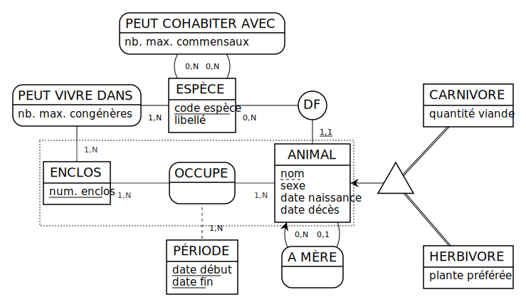

# Snapshots
## Source

```
:
    PEUT COHABITER AVEC, 0N ESPÈCE, 0N [commensale] ESPÈCE: nb. max. commensaux
:
:
:

PEUT VIVRE DANS, 1N ESPÈCE, 1N ENCLOS: nb. max. congénères
ESPÈCE: code espèce, libellé
  DF, 0N ESPÈCE, _11 ANIMAL
:
  CARNIVORE: quantité viande

ENCLOS: num. enclos
      OCCUPE, 1N ANIMAL, 1N /PÉRIODE, 1N ENCLOS
  ANIMAL: nom, sexe, date naissance, date décès
  /\ ANIMAL <= CARNIVORE, HERBIVORE: type alimentation
:

:
      PÉRIODE: date début, _date fin
    A MÈRE, 01 ANIMAL, 0N> [mère] ANIMAL
:
  HERBIVORE: plante préférée
```

## SVG output



## Relational output

### `diagram.json`

```plain
%%mocodo
:::
PEUT COHABITER AVEC: #code espèce->ESPÈCE->code espèce, _#code espèce commensale->ESPÈCE->code espèce, nb. max. commensaux
:::


:
PEUT VIVRE DANS: #code espèce->ESPÈCE->code espèce, _num. enclos, nb. max. congénères
:
ESPÈCE: code espèce, libellé
:::


::
OCCUPE: #code espèce->ANIMAL->code espèce, _#nom->ANIMAL->nom, _num. enclos, #date début->PÉRIODE->date début, #date fin->PÉRIODE->date fin
:
ANIMAL: #code espèce->ESPÈCE->code espèce, _nom, sexe, date naissance, date décès, type alimentation, CARNIVORE, quantité viande, HERBIVORE, plante préférée, #code espèce mère->ANIMAL->code espèce, #nom mère->ANIMAL->nom
:


:::
PÉRIODE: date début, _date fin
:::
```

### `mysql.json`

```sql
CREATE DATABASE IF NOT EXISTS `UNTITLED` DEFAULT CHARACTER SET utf8 COLLATE utf8_general_ci;
USE `UNTITLED`;

CREATE TABLE `PEUT_COHABITER_AVEC` (
  `code_espèce` VARCHAR(42),
  `code_espèce commensale` VARCHAR(42),
  `nb_max_commensaux` VARCHAR(42),
  PRIMARY KEY (`code_espèce`, `code_espèce commensale`)
) ENGINE=InnoDB DEFAULT CHARSET=utf8;

CREATE TABLE `PEUT_VIVRE_DANS` (
  `code_espèce` VARCHAR(42),
  `num_enclos` VARCHAR(42),
  `nb_max_congénères` VARCHAR(42),
  PRIMARY KEY (`code_espèce`, `num_enclos`)
) ENGINE=InnoDB DEFAULT CHARSET=utf8;

CREATE TABLE `ESPÈCE` (
  `code_espèce` VARCHAR(42),
  `libellé` VARCHAR(42),
  PRIMARY KEY (`code_espèce`)
) ENGINE=InnoDB DEFAULT CHARSET=utf8;

/*
CREATE TABLE `ENCLOS` (
  `num_enclos` VARCHAR(42),
  PRIMARY KEY (`num_enclos`)
) ENGINE=InnoDB DEFAULT CHARSET=utf8;
*/

CREATE TABLE `OCCUPE` (
  `code_espèce` VARCHAR(42),
  `nom` VARCHAR(42),
  `num_enclos` VARCHAR(42),
  `date_début` VARCHAR(42),
  `date_fin` VARCHAR(42),
  PRIMARY KEY (`code_espèce`, `nom`, `num_enclos`)
) ENGINE=InnoDB DEFAULT CHARSET=utf8;

CREATE TABLE `ANIMAL` (
  `code_espèce` VARCHAR(42),
  `nom` VARCHAR(42),
  `sexe` VARCHAR(42),
  `date_naissance` VARCHAR(42),
  `date_décès` VARCHAR(42),
  `type_alimentation` VARCHAR(42),
  `carnivore` BOOLEAN,
  `quantité_viande` VARCHAR(42),
  `herbivore` BOOLEAN,
  `plante_préférée` VARCHAR(42),
  `code_espèce mère` VARCHAR(42),
  `nom mère` VARCHAR(42),
  PRIMARY KEY (`code_espèce`, `nom`)
) ENGINE=InnoDB DEFAULT CHARSET=utf8;

CREATE TABLE `PÉRIODE` (
  `date_début` VARCHAR(42),
  `date_fin` VARCHAR(42),
  PRIMARY KEY (`date_début`, `date_fin`)
) ENGINE=InnoDB DEFAULT CHARSET=utf8;

ALTER TABLE `PEUT_COHABITER_AVEC` ADD FOREIGN KEY (`code_espèce commensale`) REFERENCES `ESPÈCE` (`code_espèce`);
ALTER TABLE `PEUT_COHABITER_AVEC` ADD FOREIGN KEY (`code_espèce`) REFERENCES `ESPÈCE` (`code_espèce`);
-- ALTER TABLE `PEUT_VIVRE_DANS` ADD FOREIGN KEY (`num_enclos`) REFERENCES `ENCLOS` (`num_enclos`);
ALTER TABLE `PEUT_VIVRE_DANS` ADD FOREIGN KEY (`code_espèce`) REFERENCES `ESPÈCE` (`code_espèce`);
ALTER TABLE `OCCUPE` ADD FOREIGN KEY (`date_début`, `date_fin`) REFERENCES `PÉRIODE` (`date_début`, `date_fin`);
-- ALTER TABLE `OCCUPE` ADD FOREIGN KEY (`num_enclos`) REFERENCES `ENCLOS` (`num_enclos`);
ALTER TABLE `OCCUPE` ADD FOREIGN KEY (`code_espèce`, `nom`) REFERENCES `ANIMAL` (`code_espèce`, `nom`);
ALTER TABLE `ANIMAL` ADD FOREIGN KEY (`code_espèce mère`, `nom mère`) REFERENCES `ANIMAL` (`code_espèce`, `nom`);
ALTER TABLE `ANIMAL` ADD FOREIGN KEY (`code_espèce`) REFERENCES `ESPÈCE` (`code_espèce`);
```

### `markdown.json`

```markdown
**PEUT COHABITER AVEC** (<ins>_#code espèce_</ins>, <ins>_#code espèce commensale_</ins>, nb. max. commensaux)  
**PEUT VIVRE DANS** (<ins>_#code espèce_</ins>, <ins>_#num. enclos_</ins>, nb. max. congénères)  
**ESPÈCE** (<ins>code espèce</ins>, libellé)  
<!--
**ENCLOS** (<ins>num. enclos</ins>)  
-->
**OCCUPE** (<ins>_#code espèce_</ins>, <ins>_#nom_</ins>, <ins>_#num. enclos_</ins>, _#date début_, _#date fin_)  
**ANIMAL** (<ins>_#code espèce_</ins>, <ins>nom</ins>, sexe, date naissance, date décès, type alimentation, CARNIVORE, quantité viande, HERBIVORE, plante préférée, _#code espèce mère_, _#nom mère_)  
**PÉRIODE** (<ins>date début</ins>, <ins>date fin</ins>)
```

### `markdown_verbose.json`

```markdown
**PEUT COHABITER AVEC** (<ins>_#code espèce_</ins>, <ins>_#code espèce commensale_</ins>, nb. max. commensaux)  
- Les champs _code espèce_ et _code espèce commensale_ constituent la clef primaire de la table. Ce sont des clefs étrangères qui ont migré directement à partir de l'entité _ESPÈCE_.  
- Le champ _nb. max. commensaux_ était déjà un simple attribut de l'association _PEUT COHABITER AVEC_.  

**PEUT VIVRE DANS** (<ins>_#code espèce_</ins>, <ins>_#num. enclos_</ins>, nb. max. congénères)  
- Le champ _code espèce_ fait partie de la clef primaire de la table. C'est une clef étrangère qui a migré directement à partir de l'entité _ESPÈCE_.  
- Le champ _num. enclos_ fait partie de la clef primaire de la table. C'est une clef étrangère qui a migré directement à partir de l'entité _ENCLOS_.  
- Le champ _nb. max. congénères_ était déjà un simple attribut de l'association _PEUT VIVRE DANS_.  

**ESPÈCE** (<ins>code espèce</ins>, libellé)  
- Le champ _code espèce_ constitue la clef primaire de la table. C'était déjà un identifiant de l'entité _ESPÈCE_.  
- Le champ _libellé_ était déjà un simple attribut de l'entité _ESPÈCE_.  

**ENCLOS** (<ins>num. enclos</ins>)  
- **Avertissement.** Cette table ne comportant qu'un seul champ, on peut envisager de la supprimer.
- Le champ _num. enclos_ constitue la clef primaire de la table. C'était déjà un identifiant de l'entité _ENCLOS_.  

**OCCUPE** (<ins>_#code espèce_</ins>, <ins>_#nom_</ins>, <ins>_#num. enclos_</ins>, _date début_, _date fin_)  
- Les champs _code espèce_ et _nom_ font partie de la clef primaire de la table. Ce sont des clefs étrangères qui ont migré directement à partir de l'entité _ANIMAL_.  
- Le champ _num. enclos_ fait partie de la clef primaire de la table. C'est une clef étrangère qui a migré directement à partir de l'entité _ENCLOS_.  
- Le champ _date début_ est une clef étrangère issue de l'entité _PÉRIODE_. Il devrait normalement faire partie de l'identifiant de _OCCUPE_, mais a été rétrogradé explicitement au rang de simple attribut.  
- Le champ _date fin_ est une clef étrangère issue de l'entité _PÉRIODE_. Il devrait normalement faire partie de l'identifiant de _OCCUPE_, mais a été rétrogradé explicitement au rang de simple attribut.  

**ANIMAL** (<ins>_code espèce_</ins>, <ins>nom</ins>, sexe, date naissance, date décès, type alimentation, CARNIVORE, quantité viande, HERBIVORE, plante préférée, _#code espèce mère_, _#nom mère_)  
- Le champ _code espèce_ fait partie de la clef primaire de la table. Il a migré à partir de l'entité _ESPÈCE_ pour renforcer l'identifiant faible.  
- Le champ _nom_ fait partie de la clef primaire de la table. C'était déjà un identifiant de l'entité _ANIMAL_.  
- Les champs _sexe_, _date naissance_ et _date décès_ étaient déjà de simples attributs de l'entité _ANIMAL_.  
- Le champ _type alimentation_ est ajouté pour indiquer la nature de la spécialisation (i.e., laquelle des entités-filles est concernée).  
- Un champ booléen _CARNIVORE_ est ajouté pour indiquer si on a affaire à la spécialisation de même nom.  
- Le champ _quantité viande_ a migré à partir de l'entité-fille _CARNIVORE_.  
- Un champ booléen _HERBIVORE_ est ajouté pour indiquer si on a affaire à la spécialisation de même nom.  
- Le champ _plante préférée_ a migré à partir de l'entité-fille _HERBIVORE_.  
- Les champs _code espèce mère_ et _nom mère_ sont des clefs étrangères. Ils ont migré à partir de l'entité _ANIMAL_ par l'association de dépendance fonctionnelle _A MÈRE_ en perdant leur caractère identifiant.  

**PÉRIODE** (<ins>date début</ins>, <ins>date fin</ins>)  
- Les champs _date début_ et _date fin_ constituent la clef primaire de la table. C'était déjà des identifiants de l'entité _PÉRIODE_.
```

### `oracle.json`

```sql
CREATE TABLE "PEUT_COHABITER_AVEC" (
  "code_espèce" VARCHAR(42),
  "code_espèce commensale" VARCHAR(42),
  "nb_max_commensaux" VARCHAR(42),
  PRIMARY KEY ("code_espèce", "code_espèce commensale")
);

CREATE TABLE "PEUT_VIVRE_DANS" (
  "code_espèce" VARCHAR(42),
  "num_enclos" VARCHAR(42),
  "nb_max_congénères" VARCHAR(42),
  PRIMARY KEY ("code_espèce", "num_enclos")
);

CREATE TABLE "ESPÈCE" (
  "code_espèce" VARCHAR(42),
  "libellé" VARCHAR(42),
  PRIMARY KEY ("code_espèce")
);

/*
CREATE TABLE "ENCLOS" (
  "num_enclos" VARCHAR(42),
  PRIMARY KEY ("num_enclos")
);
*/

CREATE TABLE "OCCUPE" (
  "code_espèce" VARCHAR(42),
  "nom" VARCHAR(42),
  "num_enclos" VARCHAR(42),
  "date_début" VARCHAR(42),
  "date_fin" VARCHAR(42),
  PRIMARY KEY ("code_espèce", "nom", "num_enclos")
);

CREATE TABLE "ANIMAL" (
  "code_espèce" VARCHAR(42),
  "nom" VARCHAR(42),
  "sexe" VARCHAR(42),
  "date_naissance" VARCHAR(42),
  "date_décès" VARCHAR(42),
  "type_alimentation" VARCHAR(42),
  "carnivore" NUMBER(1) DEFAULT 0 NOT NULL,
  "quantité_viande" VARCHAR(42),
  "herbivore" NUMBER(1) DEFAULT 0 NOT NULL,
  "plante_préférée" VARCHAR(42),
  "code_espèce mère" VARCHAR(42),
  "nom mère" VARCHAR(42),
  PRIMARY KEY ("code_espèce", "nom")
);

CREATE TABLE "PÉRIODE" (
  "date_début" VARCHAR(42),
  "date_fin" VARCHAR(42),
  PRIMARY KEY ("date_début", "date_fin")
);

ALTER TABLE "PEUT_COHABITER_AVEC" ADD FOREIGN KEY ("code_espèce commensale") REFERENCES "ESPÈCE" ("code_espèce");
ALTER TABLE "PEUT_COHABITER_AVEC" ADD FOREIGN KEY ("code_espèce") REFERENCES "ESPÈCE" ("code_espèce");
-- ALTER TABLE "PEUT_VIVRE_DANS" ADD FOREIGN KEY ("num_enclos") REFERENCES "ENCLOS" ("num_enclos");
ALTER TABLE "PEUT_VIVRE_DANS" ADD FOREIGN KEY ("code_espèce") REFERENCES "ESPÈCE" ("code_espèce");
ALTER TABLE "OCCUPE" ADD FOREIGN KEY ("date_début", "date_fin") REFERENCES "PÉRIODE" ("date_début", "date_fin");
-- ALTER TABLE "OCCUPE" ADD FOREIGN KEY ("num_enclos") REFERENCES "ENCLOS" ("num_enclos");
ALTER TABLE "OCCUPE" ADD FOREIGN KEY ("code_espèce", "nom") REFERENCES "ANIMAL" ("code_espèce", "nom");
ALTER TABLE "ANIMAL" ADD FOREIGN KEY ("code_espèce mère", "nom mère") REFERENCES "ANIMAL" ("code_espèce", "nom");
ALTER TABLE "ANIMAL" ADD FOREIGN KEY ("code_espèce") REFERENCES "ESPÈCE" ("code_espèce");
```

### `html_verbose.json`

```html
<html>
<head>
<meta charset='utf-8'>
<style>
  #mld .relation { font-variant: small-caps; font-weight: bold }
  #mld .primary { text-decoration: underline }
  #mld .foreign { font-style: oblique }
  #mld .normal { }
  #mld strong { font-weight: bold }
  #mld i { font-style: italic }
  #mld ul { list-style-type:square; margin: 0 0 1em 2em }
</style>
</head>
<body>
<div id='mld'>
<div>
  <span class='relation'>PEUT COHABITER AVEC</span> (
    <span class='foreign primary'>#code espèce</span>,
    <span class='foreign primary'>#code espèce commensale</span>,
    <span class='normal'>nb. max. commensaux</span>
  )
  <ul>
    <li>Les champs <i>code espèce</i> et <i>code espèce commensale</i> constituent la clef primaire de la table. Ce sont des clefs étrangères qui ont migré directement à partir de l'entité <i>ESPÈCE</i>.</li>
    <li>Le champ <i>nb. max. commensaux</i> était déjà un simple attribut de l'association <i>PEUT COHABITER AVEC</i>.</li>
  </ul>
</div>

<div>
  <span class='relation'>PEUT VIVRE DANS</span> (
    <span class='foreign primary'>#code espèce</span>,
    <span class='foreign primary'>#num. enclos</span>,
    <span class='normal'>nb. max. congénères</span>
  )
  <ul>
    <li>Le champ <i>code espèce</i> fait partie de la clef primaire de la table. C'est une clef étrangère qui a migré directement à partir de l'entité <i>ESPÈCE</i>.</li>
    <li>Le champ <i>num. enclos</i> fait partie de la clef primaire de la table. C'est une clef étrangère qui a migré directement à partir de l'entité <i>ENCLOS</i>.</li>
    <li>Le champ <i>nb. max. congénères</i> était déjà un simple attribut de l'association <i>PEUT VIVRE DANS</i>.</li>
  </ul>
</div>

<div>
  <span class='relation'>ESPÈCE</span> (
    <span class='primary'>code espèce</span>,
    <span class='normal'>libellé</span>
  )
  <ul>
    <li>Le champ <i>code espèce</i> constitue la clef primaire de la table. C'était déjà un identifiant de l'entité <i>ESPÈCE</i>.</li>
    <li>Le champ <i>libellé</i> était déjà un simple attribut de l'entité <i>ESPÈCE</i>.</li>
  </ul>
</div>

<div>
  <span class='relation'>ENCLOS</span> (
    <span class='primary'>num. enclos</span>
  )
  <ul>
    <li><strong>Avertissement.</strong> Cette table ne comportant qu'un seul champ, on peut envisager de la supprimer.</li>
    <li>Le champ <i>num. enclos</i> constitue la clef primaire de la table. C'était déjà un identifiant de l'entité <i>ENCLOS</i>.</li>
  </ul>
</div>

<div>
  <span class='relation'>OCCUPE</span> (
    <span class='foreign primary'>#code espèce</span>,
    <span class='foreign primary'>#nom</span>,
    <span class='foreign primary'>#num. enclos</span>,
    <span class='foreign'>date début</span>,
    <span class='foreign'>date fin</span>
  )
  <ul>
    <li>Les champs <i>code espèce</i> et <i>nom</i> font partie de la clef primaire de la table. Ce sont des clefs étrangères qui ont migré directement à partir de l'entité <i>ANIMAL</i>.</li>
    <li>Le champ <i>num. enclos</i> fait partie de la clef primaire de la table. C'est une clef étrangère qui a migré directement à partir de l'entité <i>ENCLOS</i>.</li>
    <li>Le champ <i>date début</i> est une clef étrangère issue de l'entité <i>PÉRIODE</i>. Il devrait normalement faire partie de l'identifiant de <i>OCCUPE</i>, mais a été rétrogradé explicitement au rang de simple attribut.</li>
    <li>Le champ <i>date fin</i> est une clef étrangère issue de l'entité <i>PÉRIODE</i>. Il devrait normalement faire partie de l'identifiant de <i>OCCUPE</i>, mais a été rétrogradé explicitement au rang de simple attribut.</li>
  </ul>
</div>

<div>
  <span class='relation'>ANIMAL</span> (
    <span class='foreign primary'>code espèce</span>,
    <span class='primary'>nom</span>,
    <span class='normal'>sexe</span>,
    <span class='normal'>date naissance</span>,
    <span class='normal'>date décès</span>,
    <span class='foreign'>type alimentation</span>,
    <span class='foreign'>CARNIVORE</span>,
    <span class='foreign'>quantité viande</span>,
    <span class='foreign'>HERBIVORE</span>,
    <span class='foreign'>plante préférée</span>,
    <span class='foreign'>#code espèce mère</span>,
    <span class='foreign'>#nom mère</span>
  )
  <ul>
    <li>Le champ <i>code espèce</i> fait partie de la clef primaire de la table. Il a migré à partir de l'entité <i>ESPÈCE</i> pour renforcer l'identifiant.</li>
    <li>Le champ <i>nom</i> fait partie de la clef primaire de la table. C'était déjà un identifiant de l'entité <i>ANIMAL</i>.</li>
    <li>Les champs <i>sexe</i>, <i>date naissance</i> et <i>date décès</i> étaient déjà de simples attributs de l'entité <i>ANIMAL</i>.</li>
    <li>Le champ <i>type alimentation</i> est ajouté pour indiquer la nature de la spécialisation (i.e., laquelle des entités-filles est concernée).</li>
    <li>Un champ booléen <i>CARNIVORE</i> est ajouté pour indiquer si on a affaire à la spécialisation de même nom.</li>
    <li>Le champ <i>quantité viande</i> a migré à partir de l'entité-fille <i>CARNIVORE</i>.</li>
    <li>Un champ booléen <i>HERBIVORE</i> est ajouté pour indiquer si on a affaire à la spécialisation de même nom.</li>
    <li>Le champ <i>plante préférée</i> a migré à partir de l'entité-fille <i>HERBIVORE</i>.</li>
    <li>Le champ <i>code espèce mère</i> est une clef étrangère. Il a migré à partir de l'entité <i>ANIMAL</i> par l'association de dépendance fonctionnelle <i>A MÈRE</i> en perdant son caractère identifiant.</li>
    <li>Le champ <i>nom mère</i> est une clef étrangère. Il a migré à partir de l'entité <i>ANIMAL</i> par l'association de dépendance fonctionnelle <i>A MÈRE</i> en perdant son caractère identifiant.</li>
  </ul>
</div>

<div>
  <span class='relation'>PÉRIODE</span> (
    <span class='primary'>date début</span>,
    <span class='primary'>date fin</span>
  )
  <ul>
    <li>Les champs <i>date début</i> et <i>date fin</i> constituent la clef primaire de la table. C'était déjà des identifiants de l'entité <i>PÉRIODE</i>.</li>
  </ul>
</div>

</div>
</body>
</html>
```

### `sqlite.json`

```sql
.open "UNTITLED";

CREATE TABLE "PEUT_COHABITER_AVEC" (
  "code_espèce" VARCHAR(42),
  "code_espèce commensale" VARCHAR(42),
  "nb_max_commensaux" VARCHAR(42),
  PRIMARY KEY ("code_espèce", "code_espèce commensale"),
  FOREIGN KEY ("code_espèce") REFERENCES "ESPÈCE" ("code_espèce"),
  FOREIGN KEY ("code_espèce commensale") REFERENCES "ESPÈCE" ("code_espèce")
);

CREATE TABLE "PEUT_VIVRE_DANS" (
  "code_espèce" VARCHAR(42),
  "num_enclos" VARCHAR(42),
  "nb_max_congénères" VARCHAR(42),
  PRIMARY KEY ("code_espèce", "num_enclos"),
  FOREIGN KEY ("code_espèce") REFERENCES "ESPÈCE" ("code_espèce")
  --, FOREIGN KEY ("num_enclos") REFERENCES "ENCLOS" ("num_enclos")
);

CREATE TABLE "ESPÈCE" (
  "code_espèce" VARCHAR(42),
  "libellé" VARCHAR(42),
  PRIMARY KEY ("code_espèce")
);

/*
CREATE TABLE "ENCLOS" (
  "num_enclos" VARCHAR(42),
  PRIMARY KEY ("num_enclos")
);
*/

CREATE TABLE "OCCUPE" (
  "code_espèce" VARCHAR(42),
  "nom" VARCHAR(42),
  "num_enclos" VARCHAR(42),
  "date_début" VARCHAR(42),
  "date_fin" VARCHAR(42),
  PRIMARY KEY ("code_espèce", "nom", "num_enclos"),
  FOREIGN KEY ("code_espèce", "nom") REFERENCES "ANIMAL" ("code_espèce", "nom"),
  -- FOREIGN KEY ("num_enclos") REFERENCES "ENCLOS" ("num_enclos"),
  FOREIGN KEY ("date_début", "date_fin") REFERENCES "PÉRIODE" ("date_début", "date_fin")
);

CREATE TABLE "ANIMAL" (
  "code_espèce" VARCHAR(42),
  "nom" VARCHAR(42),
  "sexe" VARCHAR(42),
  "date_naissance" VARCHAR(42),
  "date_décès" VARCHAR(42),
  "type_alimentation" VARCHAR(42),
  "carnivore" INTEGER,
  "quantité_viande" VARCHAR(42),
  "herbivore" INTEGER,
  "plante_préférée" VARCHAR(42),
  "code_espèce mère" VARCHAR(42),
  "nom mère" VARCHAR(42),
  PRIMARY KEY ("code_espèce", "nom"),
  FOREIGN KEY ("code_espèce") REFERENCES "ESPÈCE" ("code_espèce"),
  FOREIGN KEY ("code_espèce mère", "nom mère") REFERENCES "ANIMAL" ("code_espèce", "nom")
);

CREATE TABLE "PÉRIODE" (
  "date_début" VARCHAR(42),
  "date_fin" VARCHAR(42),
  PRIMARY KEY ("date_début", "date_fin")
);
```

### `json.json`

```json
{
  "title": "Untitled",
  "title_lowercase": "untitled",
  "title_uppercase": "UNTITLED",
  "title_titlecase": "Untitled",
  "relations": [
    {
      "this_relation_name": "PEUT COHABITER AVEC",
      "this_relation_name_lowercase": "peut cohabiter avec",
      "this_relation_name_uppercase": "PEUT COHABITER AVEC",
      "this_relation_name_titlecase": "Peut cohabiter avec",
      "this_relation_number": 1,
      "columns": [
        {
          "attribute": "code espèce",
          "raw_label": "code espèce",
          "raw_label_lowercase": "code espèce",
          "raw_label_uppercase": "CODE ESPÈCE",
          "raw_label_titlecase": "Code espèce",
          "disambiguation_number": null,
          "label": "code espèce",
          "label_lowercase": "code espèce",
          "label_uppercase": "CODE ESPÈCE",
          "label_titlecase": "Code espèce",
          "primary": true,
          "foreign": true,
          "nature": "foreign_primary_key",
          "data_type": null,
          "association_name": "PEUT COHABITER AVEC",
          "association_name_lower_case": "peut cohabiter avec",
          "association_name_uppercase": "PEUT COHABITER AVEC",
          "association_name_titlecase": "Peut cohabiter avec",
          "leg_note": null,
          "primary_relation_name": "ESPÈCE",
          "primary_relation_name_lowercase": "espèce",
          "primary_relation_name_uppercase": "ESPÈCE",
          "primary_relation_name_titlecase": "Espèce"
        },
        {
          "attribute": "code espèce",
          "raw_label": "code espèce",
          "raw_label_lowercase": "code espèce",
          "raw_label_uppercase": "CODE ESPÈCE",
          "raw_label_titlecase": "Code espèce",
          "disambiguation_number": null,
          "label": "code espèce commensale",
          "label_lowercase": "code espèce commensale",
          "label_uppercase": "CODE ESPÈCE COMMENSALE",
          "label_titlecase": "Code espèce commensale",
          "primary": true,
          "foreign": true,
          "nature": "foreign_primary_key",
          "data_type": null,
          "association_name": "PEUT COHABITER AVEC",
          "association_name_lower_case": "peut cohabiter avec",
          "association_name_uppercase": "PEUT COHABITER AVEC",
          "association_name_titlecase": "Peut cohabiter avec",
          "leg_note": "commensale",
          "primary_relation_name": "ESPÈCE",
          "primary_relation_name_lowercase": "espèce",
          "primary_relation_name_uppercase": "ESPÈCE",
          "primary_relation_name_titlecase": "Espèce"
        },
        {
          "attribute": "nb. max. commensaux",
          "raw_label": "nb. max. commensaux",
          "raw_label_lowercase": "nb. max. commensaux",
          "raw_label_uppercase": "NB. MAX. COMMENSAUX",
          "raw_label_titlecase": "Nb. max. commensaux",
          "disambiguation_number": null,
          "label": "nb. max. commensaux",
          "label_lowercase": "nb. max. commensaux",
          "label_uppercase": "NB. MAX. COMMENSAUX",
          "label_titlecase": "Nb. max. commensaux",
          "primary": false,
          "foreign": false,
          "nature": "association_attribute",
          "data_type": null,
          "association_name": "PEUT COHABITER AVEC",
          "association_name_lower_case": "peut cohabiter avec",
          "association_name_uppercase": "PEUT COHABITER AVEC",
          "association_name_titlecase": "Peut cohabiter avec",
          "leg_note": null,
          "primary_relation_name": null,
          "primary_relation_name_lowercase": null,
          "primary_relation_name_uppercase": null,
          "primary_relation_name_titlecase": null
        }
      ]
    },
    {
      "this_relation_name": "PEUT VIVRE DANS",
      "this_relation_name_lowercase": "peut vivre dans",
      "this_relation_name_uppercase": "PEUT VIVRE DANS",
      "this_relation_name_titlecase": "Peut vivre dans",
      "this_relation_number": 2,
      "columns": [
        {
          "attribute": "code espèce",
          "raw_label": "code espèce",
          "raw_label_lowercase": "code espèce",
          "raw_label_uppercase": "CODE ESPÈCE",
          "raw_label_titlecase": "Code espèce",
          "disambiguation_number": null,
          "label": "code espèce",
          "label_lowercase": "code espèce",
          "label_uppercase": "CODE ESPÈCE",
          "label_titlecase": "Code espèce",
          "primary": true,
          "foreign": true,
          "nature": "foreign_primary_key",
          "data_type": null,
          "association_name": "PEUT VIVRE DANS",
          "association_name_lower_case": "peut vivre dans",
          "association_name_uppercase": "PEUT VIVRE DANS",
          "association_name_titlecase": "Peut vivre dans",
          "leg_note": null,
          "primary_relation_name": "ESPÈCE",
          "primary_relation_name_lowercase": "espèce",
          "primary_relation_name_uppercase": "ESPÈCE",
          "primary_relation_name_titlecase": "Espèce"
        },
        {
          "attribute": "num. enclos",
          "raw_label": "num. enclos",
          "raw_label_lowercase": "num. enclos",
          "raw_label_uppercase": "NUM. ENCLOS",
          "raw_label_titlecase": "Num. enclos",
          "disambiguation_number": null,
          "label": "num. enclos",
          "label_lowercase": "num. enclos",
          "label_uppercase": "NUM. ENCLOS",
          "label_titlecase": "Num. enclos",
          "primary": true,
          "foreign": true,
          "nature": "foreign_primary_key",
          "data_type": null,
          "association_name": "PEUT VIVRE DANS",
          "association_name_lower_case": "peut vivre dans",
          "association_name_uppercase": "PEUT VIVRE DANS",
          "association_name_titlecase": "Peut vivre dans",
          "leg_note": null,
          "primary_relation_name": "ENCLOS",
          "primary_relation_name_lowercase": "enclos",
          "primary_relation_name_uppercase": "ENCLOS",
          "primary_relation_name_titlecase": "Enclos"
        },
        {
          "attribute": "nb. max. congénères",
          "raw_label": "nb. max. congénères",
          "raw_label_lowercase": "nb. max. congénères",
          "raw_label_uppercase": "NB. MAX. CONGÉNÈRES",
          "raw_label_titlecase": "Nb. max. congénères",
          "disambiguation_number": null,
          "label": "nb. max. congénères",
          "label_lowercase": "nb. max. congénères",
          "label_uppercase": "NB. MAX. CONGÉNÈRES",
          "label_titlecase": "Nb. max. congénères",
          "primary": false,
          "foreign": false,
          "nature": "association_attribute",
          "data_type": null,
          "association_name": "PEUT VIVRE DANS",
          "association_name_lower_case": "peut vivre dans",
          "association_name_uppercase": "PEUT VIVRE DANS",
          "association_name_titlecase": "Peut vivre dans",
          "leg_note": null,
          "primary_relation_name": null,
          "primary_relation_name_lowercase": null,
          "primary_relation_name_uppercase": null,
          "primary_relation_name_titlecase": null
        }
      ]
    },
    {
      "this_relation_name": "ESPÈCE",
      "this_relation_name_lowercase": "espèce",
      "this_relation_name_uppercase": "ESPÈCE",
      "this_relation_name_titlecase": "Espèce",
      "this_relation_number": 3,
      "columns": [
        {
          "attribute": "code espèce",
          "raw_label": "code espèce",
          "raw_label_lowercase": "code espèce",
          "raw_label_uppercase": "CODE ESPÈCE",
          "raw_label_titlecase": "Code espèce",
          "disambiguation_number": null,
          "label": "code espèce",
          "label_lowercase": "code espèce",
          "label_uppercase": "CODE ESPÈCE",
          "label_titlecase": "Code espèce",
          "primary": true,
          "foreign": false,
          "nature": "primary_key",
          "data_type": null,
          "association_name": null,
          "association_name_lower_case": null,
          "association_name_uppercase": null,
          "association_name_titlecase": null,
          "leg_note": null,
          "primary_relation_name": null,
          "primary_relation_name_lowercase": null,
          "primary_relation_name_uppercase": null,
          "primary_relation_name_titlecase": null
        },
        {
          "attribute": "libellé",
          "raw_label": "libellé",
          "raw_label_lowercase": "libellé",
          "raw_label_uppercase": "LIBELLÉ",
          "raw_label_titlecase": "Libellé",
          "disambiguation_number": null,
          "label": "libellé",
          "label_lowercase": "libellé",
          "label_uppercase": "LIBELLÉ",
          "label_titlecase": "Libellé",
          "primary": false,
          "foreign": false,
          "nature": "normal_attribute",
          "data_type": null,
          "association_name": null,
          "association_name_lower_case": null,
          "association_name_uppercase": null,
          "association_name_titlecase": null,
          "leg_note": null,
          "primary_relation_name": null,
          "primary_relation_name_lowercase": null,
          "primary_relation_name_uppercase": null,
          "primary_relation_name_titlecase": null
        }
      ]
    },
    {
      "this_relation_name": "ENCLOS",
      "this_relation_name_lowercase": "enclos",
      "this_relation_name_uppercase": "ENCLOS",
      "this_relation_name_titlecase": "Enclos",
      "this_relation_number": 4,
      "columns": [
        {
          "attribute": "num. enclos",
          "raw_label": "num. enclos",
          "raw_label_lowercase": "num. enclos",
          "raw_label_uppercase": "NUM. ENCLOS",
          "raw_label_titlecase": "Num. enclos",
          "disambiguation_number": null,
          "label": "num. enclos",
          "label_lowercase": "num. enclos",
          "label_uppercase": "NUM. ENCLOS",
          "label_titlecase": "Num. enclos",
          "primary": true,
          "foreign": false,
          "nature": "primary_key",
          "data_type": null,
          "association_name": null,
          "association_name_lower_case": null,
          "association_name_uppercase": null,
          "association_name_titlecase": null,
          "leg_note": null,
          "primary_relation_name": null,
          "primary_relation_name_lowercase": null,
          "primary_relation_name_uppercase": null,
          "primary_relation_name_titlecase": null
        }
      ]
    },
    {
      "this_relation_name": "OCCUPE",
      "this_relation_name_lowercase": "occupe",
      "this_relation_name_uppercase": "OCCUPE",
      "this_relation_name_titlecase": "Occupe",
      "this_relation_number": 5,
      "columns": [
        {
          "attribute": "code espèce",
          "raw_label": "code espèce",
          "raw_label_lowercase": "code espèce",
          "raw_label_uppercase": "CODE ESPÈCE",
          "raw_label_titlecase": "Code espèce",
          "disambiguation_number": null,
          "label": "code espèce",
          "label_lowercase": "code espèce",
          "label_uppercase": "CODE ESPÈCE",
          "label_titlecase": "Code espèce",
          "primary": true,
          "foreign": true,
          "nature": "foreign_primary_key",
          "data_type": null,
          "association_name": "OCCUPE",
          "association_name_lower_case": "occupe",
          "association_name_uppercase": "OCCUPE",
          "association_name_titlecase": "Occupe",
          "leg_note": null,
          "primary_relation_name": "ANIMAL",
          "primary_relation_name_lowercase": "animal",
          "primary_relation_name_uppercase": "ANIMAL",
          "primary_relation_name_titlecase": "Animal"
        },
        {
          "attribute": "nom",
          "raw_label": "nom",
          "raw_label_lowercase": "nom",
          "raw_label_uppercase": "NOM",
          "raw_label_titlecase": "Nom",
          "disambiguation_number": null,
          "label": "nom",
          "label_lowercase": "nom",
          "label_uppercase": "NOM",
          "label_titlecase": "Nom",
          "primary": true,
          "foreign": true,
          "nature": "foreign_primary_key",
          "data_type": null,
          "association_name": "OCCUPE",
          "association_name_lower_case": "occupe",
          "association_name_uppercase": "OCCUPE",
          "association_name_titlecase": "Occupe",
          "leg_note": null,
          "primary_relation_name": "ANIMAL",
          "primary_relation_name_lowercase": "animal",
          "primary_relation_name_uppercase": "ANIMAL",
          "primary_relation_name_titlecase": "Animal"
        },
        {
          "attribute": "num. enclos",
          "raw_label": "num. enclos",
          "raw_label_lowercase": "num. enclos",
          "raw_label_uppercase": "NUM. ENCLOS",
          "raw_label_titlecase": "Num. enclos",
          "disambiguation_number": null,
          "label": "num. enclos",
          "label_lowercase": "num. enclos",
          "label_uppercase": "NUM. ENCLOS",
          "label_titlecase": "Num. enclos",
          "primary": true,
          "foreign": true,
          "nature": "foreign_primary_key",
          "data_type": null,
          "association_name": "OCCUPE",
          "association_name_lower_case": "occupe",
          "association_name_uppercase": "OCCUPE",
          "association_name_titlecase": "Occupe",
          "leg_note": null,
          "primary_relation_name": "ENCLOS",
          "primary_relation_name_lowercase": "enclos",
          "primary_relation_name_uppercase": "ENCLOS",
          "primary_relation_name_titlecase": "Enclos"
        },
        {
          "attribute": "date début",
          "raw_label": "date début",
          "raw_label_lowercase": "date début",
          "raw_label_uppercase": "DATE DÉBUT",
          "raw_label_titlecase": "Date début",
          "disambiguation_number": null,
          "label": "date début",
          "label_lowercase": "date début",
          "label_uppercase": "DATE DÉBUT",
          "label_titlecase": "Date début",
          "primary": false,
          "foreign": true,
          "nature": "demoted_foreign_key",
          "data_type": null,
          "association_name": "OCCUPE",
          "association_name_lower_case": "occupe",
          "association_name_uppercase": "OCCUPE",
          "association_name_titlecase": "Occupe",
          "leg_note": null,
          "primary_relation_name": "PÉRIODE",
          "primary_relation_name_lowercase": "période",
          "primary_relation_name_uppercase": "PÉRIODE",
          "primary_relation_name_titlecase": "Période"
        },
        {
          "attribute": "date fin",
          "raw_label": "date fin",
          "raw_label_lowercase": "date fin",
          "raw_label_uppercase": "DATE FIN",
          "raw_label_titlecase": "Date fin",
          "disambiguation_number": null,
          "label": "date fin",
          "label_lowercase": "date fin",
          "label_uppercase": "DATE FIN",
          "label_titlecase": "Date fin",
          "primary": false,
          "foreign": true,
          "nature": "demoted_foreign_key",
          "data_type": null,
          "association_name": "OCCUPE",
          "association_name_lower_case": "occupe",
          "association_name_uppercase": "OCCUPE",
          "association_name_titlecase": "Occupe",
          "leg_note": null,
          "primary_relation_name": "PÉRIODE",
          "primary_relation_name_lowercase": "période",
          "primary_relation_name_uppercase": "PÉRIODE",
          "primary_relation_name_titlecase": "Période"
        }
      ]
    },
    {
      "this_relation_name": "ANIMAL",
      "this_relation_name_lowercase": "animal",
      "this_relation_name_uppercase": "ANIMAL",
      "this_relation_name_titlecase": "Animal",
      "this_relation_number": 6,
      "columns": [
        {
          "attribute": "code espèce",
          "raw_label": "code espèce",
          "raw_label_lowercase": "code espèce",
          "raw_label_uppercase": "CODE ESPÈCE",
          "raw_label_titlecase": "Code espèce",
          "disambiguation_number": null,
          "label": "code espèce",
          "label_lowercase": "code espèce",
          "label_uppercase": "CODE ESPÈCE",
          "label_titlecase": "Code espèce",
          "primary": true,
          "foreign": true,
          "nature": "strengthening_primary_key",
          "data_type": null,
          "association_name": "DF",
          "association_name_lower_case": "df",
          "association_name_uppercase": "DF",
          "association_name_titlecase": "Df",
          "leg_note": null,
          "primary_relation_name": "ESPÈCE",
          "primary_relation_name_lowercase": "espèce",
          "primary_relation_name_uppercase": "ESPÈCE",
          "primary_relation_name_titlecase": "Espèce"
        },
        {
          "attribute": "nom",
          "raw_label": "nom",
          "raw_label_lowercase": "nom",
          "raw_label_uppercase": "NOM",
          "raw_label_titlecase": "Nom",
          "disambiguation_number": null,
          "label": "nom",
          "label_lowercase": "nom",
          "label_uppercase": "NOM",
          "label_titlecase": "Nom",
          "primary": true,
          "foreign": false,
          "nature": "primary_key",
          "data_type": null,
          "association_name": null,
          "association_name_lower_case": null,
          "association_name_uppercase": null,
          "association_name_titlecase": null,
          "leg_note": null,
          "primary_relation_name": null,
          "primary_relation_name_lowercase": null,
          "primary_relation_name_uppercase": null,
          "primary_relation_name_titlecase": null
        },
        {
          "attribute": "sexe",
          "raw_label": "sexe",
          "raw_label_lowercase": "sexe",
          "raw_label_uppercase": "SEXE",
          "raw_label_titlecase": "Sexe",
          "disambiguation_number": null,
          "label": "sexe",
          "label_lowercase": "sexe",
          "label_uppercase": "SEXE",
          "label_titlecase": "Sexe",
          "primary": false,
          "foreign": false,
          "nature": "normal_attribute",
          "data_type": null,
          "association_name": null,
          "association_name_lower_case": null,
          "association_name_uppercase": null,
          "association_name_titlecase": null,
          "leg_note": null,
          "primary_relation_name": null,
          "primary_relation_name_lowercase": null,
          "primary_relation_name_uppercase": null,
          "primary_relation_name_titlecase": null
        },
        {
          "attribute": "date naissance",
          "raw_label": "date naissance",
          "raw_label_lowercase": "date naissance",
          "raw_label_uppercase": "DATE NAISSANCE",
          "raw_label_titlecase": "Date naissance",
          "disambiguation_number": null,
          "label": "date naissance",
          "label_lowercase": "date naissance",
          "label_uppercase": "DATE NAISSANCE",
          "label_titlecase": "Date naissance",
          "primary": false,
          "foreign": false,
          "nature": "normal_attribute",
          "data_type": null,
          "association_name": null,
          "association_name_lower_case": null,
          "association_name_uppercase": null,
          "association_name_titlecase": null,
          "leg_note": null,
          "primary_relation_name": null,
          "primary_relation_name_lowercase": null,
          "primary_relation_name_uppercase": null,
          "primary_relation_name_titlecase": null
        },
        {
          "attribute": "date décès",
          "raw_label": "date décès",
          "raw_label_lowercase": "date décès",
          "raw_label_uppercase": "DATE DÉCÈS",
          "raw_label_titlecase": "Date décès",
          "disambiguation_number": null,
          "label": "date décès",
          "label_lowercase": "date décès",
          "label_uppercase": "DATE DÉCÈS",
          "label_titlecase": "Date décès",
          "primary": false,
          "foreign": false,
          "nature": "normal_attribute",
          "data_type": null,
          "association_name": null,
          "association_name_lower_case": null,
          "association_name_uppercase": null,
          "association_name_titlecase": null,
          "leg_note": null,
          "primary_relation_name": null,
          "primary_relation_name_lowercase": null,
          "primary_relation_name_uppercase": null,
          "primary_relation_name_titlecase": null
        },
        {
          "attribute": "type alimentation",
          "raw_label": "type alimentation",
          "raw_label_lowercase": "type alimentation",
          "raw_label_uppercase": "TYPE ALIMENTATION",
          "raw_label_titlecase": "Type alimentation",
          "disambiguation_number": null,
          "label": "type alimentation",
          "label_lowercase": "type alimentation",
          "label_uppercase": "TYPE ALIMENTATION",
          "label_titlecase": "Type alimentation",
          "primary": false,
          "foreign": true,
          "nature": "child_discriminant",
          "data_type": null,
          "association_name": "",
          "association_name_lower_case": "",
          "association_name_uppercase": "",
          "association_name_titlecase": "",
          "leg_note": null,
          "primary_relation_name": null,
          "primary_relation_name_lowercase": null,
          "primary_relation_name_uppercase": null,
          "primary_relation_name_titlecase": null
        },
        {
          "attribute": "CARNIVORE",
          "raw_label": "CARNIVORE",
          "raw_label_lowercase": "carnivore",
          "raw_label_uppercase": "CARNIVORE",
          "raw_label_titlecase": "Carnivore",
          "disambiguation_number": null,
          "label": "CARNIVORE",
          "label_lowercase": "carnivore",
          "label_uppercase": "CARNIVORE",
          "label_titlecase": "Carnivore",
          "primary": false,
          "foreign": true,
          "nature": "child_entity_name",
          "data_type": "BOOLEAN",
          "association_name": "",
          "association_name_lower_case": "",
          "association_name_uppercase": "",
          "association_name_titlecase": "",
          "leg_note": null,
          "primary_relation_name": "CARNIVORE",
          "primary_relation_name_lowercase": "carnivore",
          "primary_relation_name_uppercase": "CARNIVORE",
          "primary_relation_name_titlecase": "Carnivore"
        },
        {
          "attribute": "quantité viande",
          "raw_label": "quantité viande",
          "raw_label_lowercase": "quantité viande",
          "raw_label_uppercase": "QUANTITÉ VIANDE",
          "raw_label_titlecase": "Quantité viande",
          "disambiguation_number": null,
          "label": "quantité viande",
          "label_lowercase": "quantité viande",
          "label_uppercase": "QUANTITÉ VIANDE",
          "label_titlecase": "Quantité viande",
          "primary": false,
          "foreign": true,
          "nature": "child_attribute",
          "data_type": null,
          "association_name": "",
          "association_name_lower_case": "",
          "association_name_uppercase": "",
          "association_name_titlecase": "",
          "leg_note": null,
          "primary_relation_name": "CARNIVORE",
          "primary_relation_name_lowercase": "carnivore",
          "primary_relation_name_uppercase": "CARNIVORE",
          "primary_relation_name_titlecase": "Carnivore"
        },
        {
          "attribute": "HERBIVORE",
          "raw_label": "HERBIVORE",
          "raw_label_lowercase": "herbivore",
          "raw_label_uppercase": "HERBIVORE",
          "raw_label_titlecase": "Herbivore",
          "disambiguation_number": null,
          "label": "HERBIVORE",
          "label_lowercase": "herbivore",
          "label_uppercase": "HERBIVORE",
          "label_titlecase": "Herbivore",
          "primary": false,
          "foreign": true,
          "nature": "child_entity_name",
          "data_type": "BOOLEAN",
          "association_name": "",
          "association_name_lower_case": "",
          "association_name_uppercase": "",
          "association_name_titlecase": "",
          "leg_note": null,
          "primary_relation_name": "HERBIVORE",
          "primary_relation_name_lowercase": "herbivore",
          "primary_relation_name_uppercase": "HERBIVORE",
          "primary_relation_name_titlecase": "Herbivore"
        },
        {
          "attribute": "plante préférée",
          "raw_label": "plante préférée",
          "raw_label_lowercase": "plante préférée",
          "raw_label_uppercase": "PLANTE PRÉFÉRÉE",
          "raw_label_titlecase": "Plante préférée",
          "disambiguation_number": null,
          "label": "plante préférée",
          "label_lowercase": "plante préférée",
          "label_uppercase": "PLANTE PRÉFÉRÉE",
          "label_titlecase": "Plante préférée",
          "primary": false,
          "foreign": true,
          "nature": "child_attribute",
          "data_type": null,
          "association_name": "",
          "association_name_lower_case": "",
          "association_name_uppercase": "",
          "association_name_titlecase": "",
          "leg_note": null,
          "primary_relation_name": "HERBIVORE",
          "primary_relation_name_lowercase": "herbivore",
          "primary_relation_name_uppercase": "HERBIVORE",
          "primary_relation_name_titlecase": "Herbivore"
        },
        {
          "attribute": "code espèce",
          "raw_label": "code espèce",
          "raw_label_lowercase": "code espèce",
          "raw_label_uppercase": "CODE ESPÈCE",
          "raw_label_titlecase": "Code espèce",
          "disambiguation_number": null,
          "label": "code espèce mère",
          "label_lowercase": "code espèce mère",
          "label_uppercase": "CODE ESPÈCE MÈRE",
          "label_titlecase": "Code espèce mère",
          "primary": false,
          "foreign": true,
          "nature": "foreign_key",
          "data_type": null,
          "association_name": "A MÈRE",
          "association_name_lower_case": "a mère",
          "association_name_uppercase": "A MÈRE",
          "association_name_titlecase": "A mère",
          "leg_note": "mère",
          "primary_relation_name": "ANIMAL",
          "primary_relation_name_lowercase": "animal",
          "primary_relation_name_uppercase": "ANIMAL",
          "primary_relation_name_titlecase": "Animal"
        },
        {
          "attribute": "nom",
          "raw_label": "nom",
          "raw_label_lowercase": "nom",
          "raw_label_uppercase": "NOM",
          "raw_label_titlecase": "Nom",
          "disambiguation_number": null,
          "label": "nom mère",
          "label_lowercase": "nom mère",
          "label_uppercase": "NOM MÈRE",
          "label_titlecase": "Nom mère",
          "primary": false,
          "foreign": true,
          "nature": "foreign_key",
          "data_type": null,
          "association_name": "A MÈRE",
          "association_name_lower_case": "a mère",
          "association_name_uppercase": "A MÈRE",
          "association_name_titlecase": "A mère",
          "leg_note": "mère",
          "primary_relation_name": "ANIMAL",
          "primary_relation_name_lowercase": "animal",
          "primary_relation_name_uppercase": "ANIMAL",
          "primary_relation_name_titlecase": "Animal"
        }
      ]
    },
    {
      "this_relation_name": "PÉRIODE",
      "this_relation_name_lowercase": "période",
      "this_relation_name_uppercase": "PÉRIODE",
      "this_relation_name_titlecase": "Période",
      "this_relation_number": 7,
      "columns": [
        {
          "attribute": "date début",
          "raw_label": "date début",
          "raw_label_lowercase": "date début",
          "raw_label_uppercase": "DATE DÉBUT",
          "raw_label_titlecase": "Date début",
          "disambiguation_number": null,
          "label": "date début",
          "label_lowercase": "date début",
          "label_uppercase": "DATE DÉBUT",
          "label_titlecase": "Date début",
          "primary": true,
          "foreign": false,
          "nature": "primary_key",
          "data_type": null,
          "association_name": null,
          "association_name_lower_case": null,
          "association_name_uppercase": null,
          "association_name_titlecase": null,
          "leg_note": null,
          "primary_relation_name": null,
          "primary_relation_name_lowercase": null,
          "primary_relation_name_uppercase": null,
          "primary_relation_name_titlecase": null
        },
        {
          "attribute": "date fin",
          "raw_label": "date fin",
          "raw_label_lowercase": "date fin",
          "raw_label_uppercase": "DATE FIN",
          "raw_label_titlecase": "Date fin",
          "disambiguation_number": null,
          "label": "date fin",
          "label_lowercase": "date fin",
          "label_uppercase": "DATE FIN",
          "label_titlecase": "Date fin",
          "primary": true,
          "foreign": false,
          "nature": "primary_key",
          "data_type": null,
          "association_name": null,
          "association_name_lower_case": null,
          "association_name_uppercase": null,
          "association_name_titlecase": null,
          "leg_note": null,
          "primary_relation_name": null,
          "primary_relation_name_lowercase": null,
          "primary_relation_name_uppercase": null,
          "primary_relation_name_titlecase": null
        }
      ]
    }
  ]
}
```

### `markdown_data_dict.json`

```markdown
- nb. max. commensaux
- nb. max. congénères
- code espèce
- libellé
- num. enclos
- nom
- sexe
- date naissance
- date décès
- type alimentation
- CARNIVORE : _BOOLEAN_
- quantité viande
- HERBIVORE : _BOOLEAN_
- plante préférée
- date début
- date fin
```

### `html.json`

```html
<html>
<head>
<meta charset='utf-8'>
<style>
  #mld .relation { font-variant: small-caps; font-weight: bold }
  #mld .primary { text-decoration: underline }
  #mld .foreign { font-style: oblique }
  #mld .normal { }
</style>
</head>
<body>
<div id='mld'>
<div>
  <span class='relation'>PEUT COHABITER AVEC</span> (
    <span class='foreign primary'>#code espèce</span>,
    <span class='foreign primary'>#code espèce commensale</span>,
    <span class='normal'>nb. max. commensaux</span>
  )
</div>
<div>
  <span class='relation'>PEUT VIVRE DANS</span> (
    <span class='foreign primary'>#code espèce</span>,
    <span class='foreign primary'>#num. enclos</span>,
    <span class='normal'>nb. max. congénères</span>
  )
</div>
<div>
  <span class='relation'>ESPÈCE</span> (
    <span class='primary'>code espèce</span>,
    <span class='normal'>libellé</span>
  )
</div>
<!--
<div>
  <span class='relation'>ENCLOS</span> (
    <span class='primary'>num. enclos</span>
  )
</div>
-->
<div>
  <span class='relation'>OCCUPE</span> (
    <span class='foreign primary'>#code espèce</span>,
    <span class='foreign primary'>#nom</span>,
    <span class='foreign primary'>#num. enclos</span>,
    <span class='foreign'>#date début</span>,
    <span class='foreign'>#date fin</span>
  )
</div>
<div>
  <span class='relation'>ANIMAL</span> (
    <span class='foreign primary'>#code espèce</span>,
    <span class='primary'>nom</span>,
    <span class='normal'>sexe</span>,
    <span class='normal'>date naissance</span>,
    <span class='normal'>date décès</span>,
    <span class='normal'>type alimentation</span>,
    <span class='normal'>CARNIVORE</span>,
    <span class='normal'>quantité viande</span>,
    <span class='normal'>HERBIVORE</span>,
    <span class='normal'>plante préférée</span>,
    <span class='foreign'>#code espèce mère</span>,
    <span class='foreign'>#nom mère</span>
  )
</div>
<div>
  <span class='relation'>PÉRIODE</span> (
    <span class='primary'>date début</span>,
    <span class='primary'>date fin</span>
  )
</div>
</div>
</body>
</html>
```

### `latex.json`

```latex
% Copy this before \begin{document}

\usepackage[normalem]{ulem}
\newenvironment{mld}
  {\par\begin{minipage}{\linewidth}\begin{tabular}{rp{0.7\linewidth}}}
  {\end{tabular}\end{minipage}\par}
\newcommand{\relat}[1]{\textsc{#1}}
\newcommand{\attr}[1]{\emph{#1}}
\newcommand{\prim}[1]{\uline{#1}}
\newcommand{\foreign}[1]{\#\textsl{#1}}

% Copy that after \begin{document}

\begin{mld}
  Peut cohabiter avec & (\foreign{\prim{code espèce}}, \foreign{\prim{code espèce commensale}}, \attr{nb. max. commensaux})\\
  Peut vivre dans & (\foreign{\prim{code espèce}}, \foreign{\prim{num. enclos}}, \attr{nb. max. congénères})\\
  Espèce & (\prim{code espèce}, \attr{libellé})\\
% Enclos & (\prim{num. enclos})\\
  Occupe & (\foreign{\prim{code espèce}}, \foreign{\prim{nom}}, \foreign{\prim{num. enclos}}, \foreign{date début}, \foreign{date fin})\\
  Animal & (\foreign{\prim{code espèce}}, \prim{nom}, \attr{sexe}, \attr{date naissance}, \attr{date décès}, \attr{type alimentation}, \attr{CARNIVORE}, \attr{quantité viande}, \attr{HERBIVORE}, \attr{plante préférée}, \foreign{code espèce mère}, \foreign{nom mère})\\
  Période & (\prim{date début}, \prim{date fin})\\
\end{mld}
```

### `text.json`

```plain
PEUT COHABITER AVEC (_#code espèce_, _#code espèce commensale_, nb. max. commensaux)
PEUT VIVRE DANS (_#code espèce_, _#num. enclos_, nb. max. congénères)
ESPÈCE (_code espèce_, libellé)
ENCLOS (_num. enclos_)
OCCUPE (_#code espèce_, _#nom_, _#num. enclos_, #date début, #date fin)
ANIMAL (_#code espèce_, _nom_, sexe, date naissance, date décès, type alimentation, CARNIVORE, quantité viande, HERBIVORE, plante préférée, #code espèce mère, #nom mère)
PÉRIODE (_date début_, _date fin_)
```

### `txt2tags.json`

```plain
Untitled
Généré par Mocodo
%%mtime(%c)
%!encoding: utf8
- **PEUT COHABITER AVEC** (__#code espèce__, __#code espèce commensale__, nb. max. commensaux)
- **PEUT VIVRE DANS** (__#code espèce__, __#num. enclos__, nb. max. congénères)
- **ESPÈCE** (__code espèce__, libellé)
%% - **ENCLOS** (__num. enclos__)
- **OCCUPE** (__#code espèce__, __#nom__, __#num. enclos__, #date début, #date fin)
- **ANIMAL** (__#code espèce__, __nom__, sexe, date naissance, date décès, type alimentation, CARNIVORE, quantité viande, HERBIVORE, plante préférée, #code espèce mère, #nom mère)
- **PÉRIODE** (__date début__, __date fin__)
```

### `postgresql.json`

```sql
CREATE DATABASE UNTITLED;
\c UNTITLED;

CREATE TABLE PEUT_COHABITER_AVEC (
  code_espèce VARCHAR(42),
  code_espèce commensale VARCHAR(42),
  nb_max_commensaux VARCHAR(42),
  PRIMARY KEY (code_espèce, code_espèce commensale)
);

CREATE TABLE PEUT_VIVRE_DANS (
  code_espèce VARCHAR(42),
  num_enclos VARCHAR(42),
  nb_max_congénères VARCHAR(42),
  PRIMARY KEY (code_espèce, num_enclos)
);

CREATE TABLE ESPÈCE (
  code_espèce VARCHAR(42),
  libellé VARCHAR(42),
  PRIMARY KEY (code_espèce)
);

/*
CREATE TABLE ENCLOS (
  num_enclos VARCHAR(42),
  PRIMARY KEY (num_enclos)
);
*/

CREATE TABLE OCCUPE (
  code_espèce VARCHAR(42),
  nom VARCHAR(42),
  num_enclos VARCHAR(42),
  date_début VARCHAR(42),
  date_fin VARCHAR(42),
  PRIMARY KEY (code_espèce, nom, num_enclos)
);

CREATE TABLE ANIMAL (
  code_espèce VARCHAR(42),
  nom VARCHAR(42),
  sexe VARCHAR(42),
  date_naissance VARCHAR(42),
  date_décès VARCHAR(42),
  type_alimentation VARCHAR(42),
  carnivore BOOLEAN,
  quantité_viande VARCHAR(42),
  herbivore BOOLEAN,
  plante_préférée VARCHAR(42),
  code_espèce mère VARCHAR(42),
  nom mère VARCHAR(42),
  PRIMARY KEY (code_espèce, nom)
);

CREATE TABLE PÉRIODE (
  date_début VARCHAR(42),
  date_fin VARCHAR(42),
  PRIMARY KEY (date_début, date_fin)
);

ALTER TABLE PEUT_COHABITER_AVEC ADD FOREIGN KEY (code_espèce commensale) REFERENCES ESPÈCE (code_espèce);
ALTER TABLE PEUT_COHABITER_AVEC ADD FOREIGN KEY (code_espèce) REFERENCES ESPÈCE (code_espèce);
-- ALTER TABLE PEUT_VIVRE_DANS ADD FOREIGN KEY (num_enclos) REFERENCES ENCLOS (num_enclos);
ALTER TABLE PEUT_VIVRE_DANS ADD FOREIGN KEY (code_espèce) REFERENCES ESPÈCE (code_espèce);
ALTER TABLE OCCUPE ADD FOREIGN KEY (date_début, date_fin) REFERENCES PÉRIODE (date_début, date_fin);
-- ALTER TABLE OCCUPE ADD FOREIGN KEY (num_enclos) REFERENCES ENCLOS (num_enclos);
ALTER TABLE OCCUPE ADD FOREIGN KEY (code_espèce, nom) REFERENCES ANIMAL (code_espèce, nom);
ALTER TABLE ANIMAL ADD FOREIGN KEY (code_espèce mère, nom mère) REFERENCES ANIMAL (code_espèce, nom);
ALTER TABLE ANIMAL ADD FOREIGN KEY (code_espèce) REFERENCES ESPÈCE (code_espèce);
```
